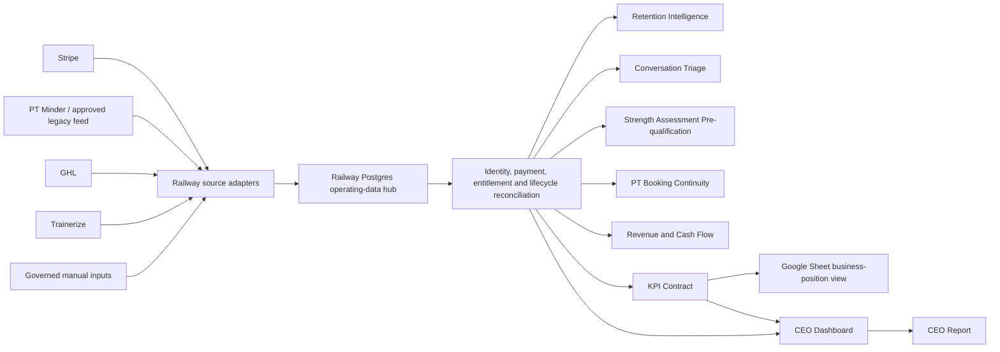

# Evolved Reporting Control Plane

**Status:** Migration in progress  
**Plan:** `plans/2026-07-27-evolved-reporting-control-plane.md`  
**Registry:** `reporting_control/report_registry.json`  
**Executive view:** `outputs/reporting-control-plane/latest-executive-brief.md`
**Workflow extension registry:** `outputs/systems/workflow-extension-registry.md`

## Owner-Approved End State

The Evolved requires one Railway-hosted operating-data hub that reconciles:

- Stripe payment and subscription evidence;
- PT Minder or its approved replacement feed for legacy debit and PT evidence;
- GHL contacts, lifecycle, conversations, appointments and assessment data;
- Trainerize access, engagement, training and progress evidence;
- the Google KPI workbook as a governed business-position view.

The hub must produce one current operational state. Retention Intelligence, Conversation Triage, Strength Assessment Pre-qualification, PT Booking Continuity, Revenue Audit, Cash Flow, KPI Refresh, the CEO report and the CEO dashboard are consumers of that state. They must not independently recreate identity, payment, entitlement or reporting-period logic.

## Purpose

This is the governing architecture for recurring business reports. It separates source evidence, report calculations and presentation so Railway, Google Sheets, Discord and Codex do not independently create different versions of the same fact.

## Current Architecture

The current implementation is transitional. The Railway/PostgreSQL hub is live in shadow mode and now owns scheduled KPI collection, source freshness, canonical current-state projections, the CEO dashboard and the CEO report API. Existing Railway domain controllers remain live and registered. Retention and PT/revenue publish the same membership reconciliation into the hub, but consumer read cutover remains behind parity gates.

The guarded workflow-extension layer uses `hub-workflow-extension-v1` to turn
accepted Hub decisions into durable internal-task intents. It stores one
deterministic idempotency key, exact owner, cooldown, suppression, consent and
evidence audit per decision. Unaccepted metrics, stale or incomplete sources,
missing owners and unaccepted workflow policies remain preview-only. Technical
readiness and metric publication do not substitute for a separately accepted
decision. Client messages and GHL, Stripe, Trainerize, PT Minder or Google
Sheet mutations are rejected. The activation register is
`outputs/systems/workflow-extension-registry.md`.

On 31 July 2026, source freshness was made semantically accurate. A successful
check now publishes a new observation even when roster content is unchanged,
while owner-approved effective-dated payment rules remain governed
configuration rather than expiring like an operational feed. Retention
deployment `42160443-6ae9-4efa-9ee6-4be7b5326b21` refreshed membership and
Stripe evidence; PT deployment `7edb31ab-9819-4a0d-aeaf-a81da0fdd2d1`
refreshed the unchanged roster without duplicate additions; Conversation
Triage deployment `b6cd5586-044e-4f4d-bdca-5943f20c582f` restored hub
publication on the 06:00/18:00 Brisbane schedule; and hub deployment
`a725fab4-a1cb-423f-b902-6d4327318a3a` removed the false stale state from
governed payment rules. Roster removals and existing-service changes still
fail closed for review.

### Reporting V2 local shadow foundation

Peter approved the governed Reporting V2 implementation plan on 29 July 2026. Railway deployment `50d569f2-98e4-4c08-b2e6-1a81c4e9b80e` made the protected V2 foundation and GHL acquisition bridge live in shadow mode on 30 July 2026. The V2 layer has no publication authority.

The implementation adds:

- immutable source-event versions with source IDs, UTC times, Brisbane reporting dates, payload hashes, confidence and acceptance state;
- immutable metric definitions plus metric runs, observations, numerators, denominators and event lineage;
- completed-week, rolling 28-day and rolling 90-day period contracts;
- separate sale, sale-service-component and assessment-attribution records so one Fast Track sale can contain SGPT and PT without becoming two conversions;
- controlled manual inputs with independent approval;
- raw-workbook row hashes and verified, high, medium, low, legacy-aggregate and unresolved historical confidence;
- parallel-run records that cannot accept cutover while events or cents remain unexplained;
- a Strength Assessment attendance shadow projection using the existing `sa-attendance-v1` reconciliation;
- authenticated shadow status, metric-dictionary and board-pack-contract endpoints;
- a Google board-pack schema with all publication disabled;
- manual-input endpoints disabled unless `REPORTING_V2_MANUAL_INPUTS_ENABLED=true`.
- a read-only GHL acquisition bridge for contact-created leads, WARM-pipeline prequalification, signed-agreement sales and the approved 30-day unique assessment-conversion rule;
- a read-only GHL onboarding bridge covering the generic onboarding calendar, every current or historically relevant trainer Intro calendar and the governed trainer PT calendars, with entitlement-specific sale-to-first-booking linkage and explicit separation of booked, completed, cancelled, missed and elapsed-but-unverified appointments;
- completed-week, rolling 28-day and rolling 90-day shadow observations for leads, unique assessment bookings, prequalification completion, unique assessment conversion, sale-to-onboarding booking speed and onboarding completion speed;
- an authenticated acquisition preview endpoint that has no dashboard publication authority;
- a twice-daily Railway shadow schedule at 06:18 and 18:18 Brisbane, positioned after attendance collection and before whole-hub health.

The local hub suite has 106 passing tests. Live deployment `810c3a04-f864-4eaa-a8aa-005da77a48df` returned `mode: shadow` and `publication_impact: none`. No current KPI workbook cell, accepted CEO dashboard card, live report, GHL workflow, source-system record or Google Sheet has changed. The implementation and acceptance plan is `plans/2026-07-29-reporting-v2-governed-event-architecture.md`; the plain-English build map is `outputs/reporting-control-plane/reporting-v2-build-update-2026-07-30.md`.

The 30 July acceptance sample exposed that Fast Track and PT-only starts can be booked directly into ordinary trainer PT calendars. Deployment `b54dfb06-2d6b-499e-b58e-1e4ab737c12e` repaired that coverage while preventing an unrelated PT session from satisfying a Strong onboarding entitlement and collapsing duplicate same-time bookings. The repair increased historical onboarding-required sales with a linked booking from 37 of 109 to 82 of 109. The completed week now has a three-day booking average across two linked sales; the rolling 28 days has a 3.82-day average across 11 linked sales; and the rolling 90 days has a 3.74-day average across 31 linked sales. Lead, booking, prequalification and conversion counts were unchanged.

Deployment `ecec9d28-e116-48be-b443-627ad79aa8cd` activated a governed onboarding-outcome follow-up. The first run created six trainer tasks for recent elapsed appointments still recorded as `Confirmed`, with zero routing exceptions. Six Admin Eve escalations were deferred and will be created only on the next twice-daily cycle if the trainer tasks remain unresolved. A recorded `Showed`, `No show` or `Cancelled` outcome closes the governed task. The system sends no client message and never infers an outcome.

Deployment `bad4101c-0f1d-47da-bd86-ea54a0559756` added the approved historical Strength Assessment boundary. Appointments before 30 July 2026 that survived as elapsed confirmed records are retained as legacy attended because the prior process deleted no-shows and cancellations. They may support conversion attribution with `legacy_aggregate` confidence but are excluded from show and cancellation rates because the historical denominator is incomplete. From 30 July onward, explicit Showed, No show and Cancelled outcomes govern separate show-rate and cancellation-rate metrics. The legacy-aware rerun retained 84 historical attendances and attributed 12 agreement-based sales. All 88 hub tests and 335 non-live local regression tests pass.

### Shadow hub implementation checkpoint

The production shadow service is deployed as `Evolved Operating Data Hub` at `https://evolved-operating-data-hub-production.up.railway.app`. It now includes:

- PostgreSQL or SQLite-compatible source snapshot and job ledgers;
- idempotent source acceptance by fingerprint;
- strict PT Minder snapshot validation and authenticated ingestion;
- canonical people, source identities, governed cohort membership, service relationships, lifecycle states, commercial entitlements, payment accounts and payment-event projections;
- an authenticated source-neutral commercial-evidence contract for recurring Stripe billing, explicitly mapped Stripe prepaid packs, PT Minder and approved governed adjustments;
- current-state retirement rules so services removed by a later reconciliation cannot remain falsely active;
- scheduled Google KPI collection with active-status filtering;
- compatibility health collection for Retention Intelligence, PT Booking Continuity and Revenue Control;
- fail-open aggregate publishers for retention, PT, revenue and conversation triage;
- per-source freshness controls;
- authenticated CEO dashboard and aggregate CEO report API;
- a manual CSV or JSON PT Minder upload command;
- fail-open compatibility behaviour so a hub outage cannot interrupt an existing controller;
- 206 passing connected hub and controller tests.

Deployment `f8720561-e1f9-43f3-86ea-d1270518646f` made the canonical current-state rules and clarified reconciliation labels live on 27 July 2026. Hub source health now selects exactly one latest accepted snapshot per source, removing the duplicate dashboard rows that were caused by tied observation times.

The accepted PT Minder V2 snapshot has been projected into the canonical store without another browser login: 27 PT Minder payment accounts, 540 actual payment events and 27 source identities. Internal Charge entries and displayed balances remain excluded.

Retention Intelligence deployment `160c850a-0cf0-4b83-a742-f24e47f7e3e7` and PT/revenue deployment `a7201464-b700-4549-861a-cf713d6d87d8` publish the same versioned membership reconciliation to the hub through Railway-managed secret references. Source timestamps used for date-only fields are normalized at the contract boundary. This preserves multiple simultaneous service components, including Fast Track plus an approved PT add-on, rather than forcing one membership label per person.

The first complete membership projection was accepted on 27 July 2026 with 2,336 reconciled identity rows. The resulting state contains 2,337 canonical people including the PT Minder-only identity set, 3,174 source identities and 255 evidence-derived service relationships. Historical or inactive rows remain available for audit.

Hub deployments `0c7ca1dd-0bc7-406f-a209-ff5714d61bb4` and `3445a6e4-6d05-4803-b86f-4a9f1236dc4c` made identity-level roster candidacy and guarded promotion live on 28 July 2026. PT/revenue deployment `75978cc6-edcf-4c77-9308-67f72ae2af3e` publishes the live Google roster at the start of the existing Railway audit, independently of the heavier revenue reconciliation. Hub deployment `6ac8d6af-fffa-423a-807d-133a069c74c9`, PT deployments `39152bef-0255-4373-bff0-a369a1e9fe74` and `f81541f0-7a20-439c-8515-f9910dda04c8`, and Retention deployment `7f1fabe2-a6ab-4168-8121-edc94eb7e010` added the fail-closed prepaid-pack source and consistent `pt only` lifecycle rule. Rule `active-client-cohort-v2` has now accepted all five governed additions since the original 127-person baseline. Owner-classification snapshot `20260727T235921Z-c7d4822c` and guarded promoted snapshot `20260727T235924Z-035b3dcc` persist 132 authoritative active clients, 143 service relationships and zero owner decisions. Candidate snapshot `20260727T220111Z-695790c4` remains an exact identity match: 132 accepted, 132 candidate, zero additions and zero removals. The old 191 lifecycle projection remains available only as explicitly labelled legacy audit evidence.

The projection also created 138 service-level entitlement placeholders without inventing payment proof. The commercial-evidence ingestion contract verifies entitlements and attaches payment accounts and immutable payment events while remaining unable to promote lifecycle state. Existing PT Minder evidence remains 27 accounts and 540 actual payment events.

Retention Intelligence deployment `3d5de382-609f-416f-b400-711e00139f00` performs one shared 35-day Stripe invoice read during its existing daily source reconciliation and publishes the resulting commercial evidence to the hub. The first production shadow feed accepted 269 Stripe-linked identities, 285 payment accounts, 86 current subscription entitlements and 418 recent invoice events. Active subscription status without a matching paid invoice remains pending, not confirmed.

Hub deployment `48186493-4a4e-450e-8c47-15e1d03f1248` made commercial coverage service-specific on 28 July 2026. A governed client is now fully commercially verified only when every governed SGPT or PT relationship has compatible confirmed evidence. SGPT may be covered by SGPT or Fast Track evidence; PT requires personal-training evidence. This stricter rule reports 68 fully covered clients and 64 clients with 68 service-level gaps. The earlier 76 verified and 56 pending figures were person-level and could conceal an uncovered second service for cross-service clients.

The same deployment added one deterministic entitlement exception queue to the CEO dashboard and CEO report. It contains eight aggregate buckets and 22 high-priority service gaps, with Admin Eve as the current operational owner. The protected `GET /api/v1/entitlement-exceptions` endpoint exposes identified cases only with the hub secret. Dashboard and CEO-report surfaces remain aggregate and privacy-safe. Queue cases are evidence states, not automatic debts, and the queue creates no member-system writes.

Hub deployment `d5b4c7a5-d85f-4770-a668-a9601623959f` and PT/Revenue deployment `7c295d70-ddd2-46a6-9ef8-a9b3e492d1a8` connected the exact service-level Revenue Control result on 28 July 2026. Only `CLEAN_COLLECTING` assessments with a current underlying Stripe, approved PT Minder/EziDebit or approved external receipt become confirmed entitlement. All other current assessments are published as non-promoting queue context. Duplicate same-service roster rows are isolated as pending owner review rather than blocking the other clients or creating entitlement.

Accepted snapshot `20260727T232032Z-65c36279` contains 138 current service assessments. It increased full commercial coverage from 68 to 93 clients and reduced the queue from 64 to 39 clients and from 68 to 41 service gaps. The stale `collecting_not_shared` bucket is now empty: 24 of its 30 former gaps gained confirmed evidence and six were reclassified from the latest audit; three additional gaps in other former buckets also gained valid current evidence. The live queue contains seven buckets and 25 high-priority service gaps.

Hub deployment `bafe3fe4-ccd2-4bde-a7e1-ec4578de1ec6` and PT/Revenue deployment `37b25759-bc05-430f-b7ce-e9f2ed2b61ef` replaced the broad 17-gap payment-and-booking bucket with current purpose-aware evidence on 28 July 2026. Snapshot `20260727T233558Z-bf8052d3` separates two PT services with future bookings but unresolved payment from 15 services with no current authoritative payment evidence. No active-contract-without-receipt cases remain in this cycle. Coverage remains 93 verified clients and 39 pending clients with 41 service gaps; the queue now has eight actionable buckets and 25 high-priority gaps.

PT/Revenue deployments `929f35ce-713e-42a8-89c0-83f6cf155403`, `a929e567-bf18-440c-a713-8dfb4430044d` and `de210c8c-57ab-47b6-816c-75da80fe321f` made governed SGPT PIF/PIA entitlement evidence renewal-bound on 28 July 2026. The live audit now reads the Sheet's contract-length and renewal columns, normalizes Google serial dates at the contract boundary, and confirms SGPT entitlement only while an explicit PIF or PIA marker has a current or future renewal boundary. This is evidence of current entitlement, not proof of the historical cash receipt. Commercial snapshot `20260728T000451Z-8e69e29d` promoted six clients, moving full coverage from 93 to 99, reducing pending clients from 39 to 33 and service gaps from 41 to 35, and removing the prepaid/PIA exception bucket. The queue now has seven buckets and retains 25 high-priority gaps.

Hub deployment `dd9635f7-92d4-4bc2-a1e8-45cf5cd516fa` replaced the remaining 15-case no-current-payment bucket with purpose-aware routing on 28 July 2026. Five current SGPT arrangements have matching PT Minder recurring evidence and now wait in a medium-priority parity bucket until the second independent capture passes. Seven recent Stripe receipts on cancelled accounts require a paid-through or final-access end date. One current failed debit joins arrears retry, one paused payment account conflicts with an active roster service, and one PT Minder payment purpose does not match the governed roster service. The build also corrected the shared classifier so `SGPT` is never mistaken for the `PT` substring and Bronze, Silver and Gold package descriptions map to SGPT. Commercial coverage remains 99 verified and 33 pending with 35 service gaps; high-priority gaps fell from 25 to 20 because the five PT Minder shadow cases are no longer presented as missing payment.

Hub deployments `8b74d947-e58e-4ff3-8e6b-78bebe443689` and `d15b3c32-b4fa-4ee4-af53-4e0fe976c345`, with Retention Intelligence deployments `8af0c770-3cd6-45b0-a74a-a7b99c1d226b` and `cc4ee489-49f5-4eb0-a467-eb1af6f5950f`, made Stripe invoice-line coverage windows live on 28 July 2026. Payment events now carry exact coverage start and end dates, and confirmed entitlements count only when the governed cohort date falls inside that window. One-day invoice lines cannot create ongoing entitlement. The seven targeted $349 to $599 payments all have same-day Stripe line periods and are now explicitly classified as one-time invoices with a missing entitlement term, not as recurring coverage or expired subscriptions. Julie Nina Guilhem's separate paid invoice has a valid 22 to 29 July SGPT window, moving full coverage from 99 to 100 and reducing the queue to 32 clients and 34 service gaps. High-priority gaps remain 20.

Verified prepaid PT packs now use a separate `stripe_pack` commercial source so recurring subscriptions and pack purchases cannot be confused. The existing Monday PT audit publishes only successful one-off PaymentIntents that have an explicit Railway-managed payment-to-GHL-beneficiary mapping. Same-email one-off payments, payment amounts and appointment text cannot create entitlement. An empty approved map publishes an empty snapshot and supersedes prior pack state, so deleted mappings do not remain active by accident. GHL remains lifecycle authority: the exact current `pt only` tag is accepted unless an `old pt client`, cancellation or termination control overrides it; the generic `personal training` tag alone remains insufficient.

The former dashboard count of 191 was not an active-signal cohort. It combined 152 people with at least one GHL, Stripe-contract or Trainerize signal and 39 people with only a non-empty cancellation field, including literal `None` values. After Peter approved Anita Brown's historical email alias on 28 July, all 127 governed identities match and 64 appear only in the former hub count. The net count gap and symmetric identity difference are both 64.

The protected reconciliation keeps the original 191-person audit cohort frozen, then overlays the latest completed source reconciliation for current status. This prevents a corrected lifecycle record from rewriting history while automatically removing resolved cases from the owner queue. Eliza Lebsanft is the first verified self-mending example: her historical signal remains auditable, but her current GHL, Stripe and Trainerize signals are all inactive, her final access ended 4 March 2026 and she no longer appears in owner review.

Emma Johnson is the second verified correction. Her GHL holiday hold ran from 4 to 18 July and is `Completed`; the hold workflow never removes Active SGPT rows. Her GHL membership, active Stripe subscription, successful A$99 payment on 23 July and active Trainerize account prove current service. Peter approved restoring the missing Active SGPT row on 28 July.

A fresh workbook verification after Reemi's restoration reports 97 active SGPT relationships, 46 active PT relationships, 11 cross-service overlaps and 132 unique active roster clients. Railway now accepts all 132 identities and all 143 relationships after Vavaa's approved prepaid-pack entitlement was represented in the shared contract.

Erica Asler is the third approved timing correction. GHL proves a Won PT-only lifecycle with no hold or cancellation, Stripe proves an active A$60 weekly 30-minute PT subscription and first paid invoice on 27 July, and Trainerize proves active access. Her existing Active PT and Sales rows were completed on 28 July without creating duplicate rows. The live PT agreement workflow was inspected read-only and found to leave the corresponding commercial and provisioning columns unmapped; no live workflow change was made.

Madison McKiernan is the fourth approved timing correction. Her GHL, Stripe and Trainerize records already resolved to one active Bronze SGPT client, but the Sales worksheet email omitted the final `1` and no Active SGPT row existed. Peter authorised normalising her GHL surname, correcting Sales row 76 and adding Active SGPT row 102. The canonical email now appears exactly once in Active SGPT and the typo appears nowhere in Sales.

Reemi Shah is the fifth approved timing correction. GHL and Gmail prove her historical hold was actioned; Stripe subsequently resumed and collected the 16 and 23 July invoices, Trainerize remains active and no cancellation evidence exists. Peter authorised changing the stale GHL hold status from `Pending Hold` to `Completed`, normalising the surname and adding Active SGPT row 103. Historical hold dates were retained.

Sue Goodwin is a governed service-scope correction, not a roster timing addition. Owner correspondence proves she changed from Strong, Fit & Flexible to the A$69 weekly Evolved Anywhere hybrid service after the standard 30-day change notice; current Stripe payments and Trainerize activity confirm ongoing entitlement and access. Her GHL hold status is now `Completed`, her Won membership opportunity is in Online Only, the workbook retains exactly one Active Online row labelled Evolved Anywhere and Sales now records Trainerize provisioning. She is excluded from the SGPT/PT KPI and no cancellation or SGPT/PT row was created.

Tsana Leatham closes the final owner-review case. Peter confirmed that she is Megan's friend with an approved free membership and instructed that no workbook roster row is required. GHL and Trainerize prove current access, while the absence of Stripe billing is expected and Gmail and the cancellation tabs contain no cancellation evidence. The GHL placeholder surname was corrected to Leatham, and the governed `complimentary_member` classification now excludes her from the client KPI and suppresses false missing-payment exceptions without treating her as staff. Sue Goodwin's `online_client` classification and Tsana's `complimentary_member` classification were published to Railway on 28 July through owner-classification snapshot `20260727T235921Z-c7d4822c` and guarded promoted snapshot `20260727T235924Z-035b3dcc`. The Railway owner queue is now zero; all five timing additions remain accepted, and the 132-person roster retains exact parity with the live candidate.

The exact acceptance result is recorded in `outputs/reporting-control-plane/active-roster-acceptance-2026-07-28.md`. Identified evidence remains protected in Railway. The earlier frozen 191-person audit is retained at `outputs/reporting-control-plane/active-client-cohort-reconciliation-2026-07-27.md`.

Conversation Triage deployment `99f59967-e63a-41ba-8d59-aacae3a0410f` retains its Railway cron and now publishes aggregate classification totals to the hub through a Railway secret reference. A hub outage cannot block its existing Discord or email delivery.

The first production collection completed on 27 July 2026. The authenticated dashboard reported 127 unique active clients, 138 service relationships and $10,927 current-period cash. The hub accepted fresh `google_kpi`, `retention_intelligence`, `pt_booking_continuity` and `revenue_control` snapshots, and both the KPI and compatibility-health jobs completed successfully.

The first owner-initiated PT Minder capture also completed on 27 July 2026. It reconciled the complete 27-record active-client list against 82 detailed July payment entries: 24 active accounts had a payment in the last 30 days, three active accounts had no recent PT Minder payment, and one recent payer was not in PT Minder's active-client cohort. Railway accepted the validated 27-record snapshot as `20260727T025751Z-9d3da706`; PT Minder now appears fresh on the CEO dashboard. No PT Minder data was changed and no local schedule was created.

The PT Booking, Revenue Audit and Cash Flow controller now reads that accepted snapshot through the authenticated hub source contract in shadow mode. The first production comparison completed on 27 July without changing controller inputs: 24 hub payment-evidence rows were compared with 24 protected legacy rows, 14 matched exactly, nine had field differences, one existed only in the hub projection and one only in the legacy register.

The same-day reconciliation resolved every deterministic difference. Five stale date-only rows were refreshed from the accepted PT Minder evidence, Belinda Peters was updated from review to collecting after a later successful receipt was verified, and Jillian Breen's approved identity link was applied before comparison.

A read-only check of Anne's live PT Minder record confirmed that this is not evidence of multiple payment agreements. Her commercial arrangement is a recurring $69 weekly Evolved Anywhere membership plus optional one-on-one PT sessions purchased as she goes. The hub incorrectly treated the latest transaction of any purpose as PT evidence.

The reporting contract now separates service type (`sgpt`, `personal_training`, `other`) from cadence (`recurring`, `ad_hoc`, `other`). Anne contributes $69 per week to recurring run-rate; each completed one-on-one PT payment contributes variable cash and creates only the explicitly purchased PT entitlement. Ad-hoc PT is never projected as recurring weekly revenue.

Hub commit `a844568` and PT Booking commit `8d70454` deployed the corrected V2 contract and fail-closed consumer on 27 July. The protected recurring evidence for Anne was corrected from the ad-hoc $120 PT purchase to the $69 Evolved Anywhere fee, with a recoverable pre-change copy retained. Live V1 parity is now 22 exact matches, two explained mismatches and no hub-only or legacy-only rows.

Peter confirmed Bronte Holt's current commercial position as $69 per week with entitlement to two SGPT sessions per week. Bronte submitted 30 days' downgrade notice on 8 June 2026; the former $149 arrangement ended on 7 July and the $69 membership took effect on 8 July. Her service classification and effective date are therefore resolved.

Peter confirmed that Bronte is fully up to date. The temporary adjustment has been completed, so the $47 pending item and PT Minder's displayed $590 balance are not open exceptions.

PT Minder is not used as an accurate ledger of amounts owed. Its displayed balance and internal Charge function must never create a debt, revenue-gap, collection or member-status alert. Reporting uses actual debit and payment events only. A specific failed scheduled payment outside an approved hold creates a retry action; a successful retry closes it.

Peter then confirmed that Rabail Aisha returned to active service. A live PT Minder check verifies an active $99 weekly Bronze recurring-payment schedule and a $99 debit dated 24 July, pending for the 24–30 July service week. Her return is effective 24 July: include $99 in scheduled run-rate and the active-member KPI, but do not count the pending debit as cleared cash. Pending is not failed, so no retry or arrears action exists unless the payment later fails.

The first complete V2 capture was accepted by Railway on 27 July as `20260727T082105Z-5a9058f4`. It contains all 27 active accounts and 540 actual Ezidebit payment events: 524 completed, seven pending and nine historical dishonours. Internal PT Minder Charge entries and displayed balances were excluded at capture.

The V2 contract now carries an explicit normalized weekly rate from the live recurring schedule. Fortnightly $198 and $298 collections therefore contribute $99 and $149 per week respectively, while Bronte remains $69 and Rabail remains $99 despite their pending return or adjustment debits. Historical product changes are no longer mistaken for simultaneous recurring agreements.

Hub deployment `558a2f5b-35e8-4119-b361-fca6935e9a38` and PT Booking deployment `1b6214c9-fb5b-40f5-b5e0-efcc3067bb54` are healthy. The first finalized V2 comparison exposed nine mismatched rows and one hub-only row for protected review.

That review caught two source-projection defects before any legacy row was changed. A historical retry could overwrite the real current due date, and Deborah Farrell's product was explicitly marked paused even though the captured client state said collecting. Deployment `fee1b5ad-0235-4fdf-9fc4-dc523014cee1` now takes the latest valid current schedule across completed and pending events and excludes products explicitly marked paused.

Seven evidence-backed register rows were refreshed. Bronte and Rabail now carry their owner-confirmed collecting states; five current schedule dates were rolled forward; Shelley's current live $199 schedule replaced the former $149 run-rate. Chloe and Lauryn were not changed because their protected dates were correct and the mismatches came from stale retry records. Deborah was not added because her product is paused.

Shelley's $199 schedule is now decomposed consistently from 3 August 2026 as $99 Fast Track SGPT plus two weekly 30-minute PT sessions at $50 each. GHL carries the contact, package and `PT 2 p.wk` service state; the business workbook carries the reporting allocation; PT Minder remains the single payment schedule; and GHL appointments remain the delivery evidence.

PT Booking deployment `86be3916-b9df-4f62-9ebd-c72dab4a671f` made the component rule live on 27 July 2026. A silent Monday reconciliation then completed as run `3e4b253e-0f14-45b8-8087-661700de628d`; all 147 affected tests passed before promotion.

The production result is now 24 of 24 exact, with zero field differences, zero hub-only or legacy-only rows and zero ambiguous recurring accounts. All 146 affected tests pass. The pre-change register is retained at `/data/revenue-gap-control/legacy-payment-evidence.pre-v2-final-reconcile-20260727.csv`.

This is the first clean V2 parity cycle. Existing reports continue on protected inputs until a second independent PT Minder capture passes during the next owner login; a repeated comparison against the same snapshot is not counted as independent confirmation.

The parity work identified and corrected a cohort-definition defect before deployment: five SGPT arrears rows belong in revenue review but not in the active-client KPI.

## System Authority Matrix

Conflicts are resolved by evidence type and effective date, never by whichever source was read last.

| Business fact | Authoritative source | Supporting source |
|---|---|---|
| Person and contact identity | GHL plus approved identity links | Stripe, PT Minder and Trainerize identifiers |
| Cleared cash and Stripe payment status | Stripe | Google Sheet cash-close control |
| Legacy debit or PT Minder payment evidence | Specific completed or failed PT Minder debit/payment events | Revenue-control retry register; PT Minder displayed balances and internal Charge entries are ignored |
| Membership lifecycle and communication consent | GHL | Payment and access evidence |
| Coaching-platform access and engagement | Trainerize | GHL lifecycle |
| Strength and workout progression | Trainerize | Strength Assessment records |
| PT appointments delivered and booked | GHL appointment calendars | Payment entitlement and approved pack ledger |
| PT session entitlement | Product/payment evidence plus controlled session ledger | GHL booking and delivery evidence |
| Conversations and support ownership | GHL Conversations | Canonical lifecycle and payment state |
| Board KPI presentation | Governed hub metrics | Google Sheet as the approved business-position view |

Google Sheets is not the integration database. It is a controlled presentation and manual-input surface. The hub retains metric definitions, source lineage and reconciliation evidence.

## PT Minder Human-Assisted Ingestion

PT Minder is an approved exception to fully automated source extraction.

Once each week:

1. Peter signs in to PT Minder locally through the browser.
2. Peter explicitly starts a read-only PT Minder refresh.
3. The browser capture collects only the approved payment and account-state fields.
4. The capture is normalised and submitted to an authenticated Railway ingestion endpoint.
5. Railway validates completeness, record counts, observation time and fingerprint before accepting the snapshot.
6. Revenue Audit, Cash Flow and PT Booking Continuity consume the same accepted snapshot.

The local browser does not schedule reports, calculate business metrics or retain PT Minder credentials. Railway remains the only reporting scheduler and system of record for accepted snapshots.

The approved minimum capture is:

- PT Minder account or customer identifier;
- linked member identity evidence;
- agreement or product identifier;
- active, paused, cancelled or arrears state;
- last successful payment date and amount;
- next scheduled payment date and amount when available;
- failed or overdue payment evidence;
- source observation time.

Bank-account, card and other unnecessary payment credentials must never be captured.

The Railway hub must:

- retain the previous complete snapshot if a refresh is partial or fails;
- mark PT Minder evidence stale after eight days;
- show snapshot age and record-count movement on the CEO dashboard;
- send a Railway-originated stale-source alert;
- prevent a stale snapshot from silently appearing current;
- preserve source lineage and the snapshot fingerprint;
- reconcile PT Minder and Stripe accounts without double-counting the same person or entitlement.

## Canonical Hub Model

The minimum shared objects are:

- person and source identity;
- service relationship;
- payment account and payment event;
- membership or coaching access;
- PT entitlement, allocation and session consumption;
- appointment and attendance;
- conversation case and service-level ownership;
- Strength Assessment lead, qualification evidence and outcome;
- reporting period and source snapshot;
- exception, confidence, owner, due date and disposition.

Every source record retains its source ID, observed time, effective time and source-run ID. Derived state retains the rule version and evidence used.

## Hub-First System Governance

The main protection against future inefficiency is a system-admission gate.

No new automation, report, bot, dashboard or intelligence module may:

- create a separate person or client master;
- extract the same source data independently when a current hub snapshot exists;
- define payment, entitlement, active-client or reporting-period logic locally;
- write directly to another module's private tables;
- schedule itself outside the Railway job registry;
- maintain its own delivery ledger;
- publish a KPI without a versioned metric definition;
- treat Google Sheets as the integration database;
- silently accept stale or partial source data;
- send member communications without the governing workflow and consent controls.

Every proposed system must declare:

1. the business decision it supports;
2. its accountable owner;
3. the canonical entities it reads or writes;
4. its authoritative sources and supporting evidence;
5. the existing source snapshots it will reuse;
6. its input and output data contracts;
7. its freshness requirement and failure behaviour;
8. whether its output is advisory, operational or authoritative;
9. its privacy classification and retention rule;
10. its downstream consumers and retirement plan.

If a proposal cannot answer those ten questions, it is not ready to build.

## Shared Platform Services

The hub provides the following once for every consumer:

- canonical person and source-identity resolution;
- payment and entitlement reconciliation;
- lifecycle and service-relationship state;
- source extraction and snapshot storage;
- reporting periods and metric definitions;
- exception ownership and disposition;
- job scheduling, leases, retries and catch-up;
- delivery deduplication;
- consent and privacy enforcement;
- source freshness and data-quality monitoring;
- aggregate dashboard and report contracts;
- audit history and rule-version lineage.

Intelligence modules contain only their domain rules. For example, Retention Intelligence may classify retention state, but it must obtain identity, payment, membership and freshness from the hub.

## Change-Control Process

Every material architecture change requires a short architecture decision record before implementation.

The decision record must capture:

- problem and expected business value;
- options considered;
- selected design;
- authority-matrix impact;
- data-contract and schema changes;
- privacy and failure risks;
- migration and shadow-parity plan;
- legacy component to retire;
- owner and review date.

Schema and contract changes are versioned. Consumers must remain compatible during one migration window. A replacement is complete only when the old extraction, scheduler, table, report or manual process has been explicitly retired.

## Efficiency Controls

The CEO dashboard should expose platform efficiency as well as business performance:

- source API calls by system and reporting period;
- snapshot reuse count;
- duplicate extraction attempts prevented;
- stale and failed source runs;
- active compatibility paths awaiting retirement;
- reports without current lineage;
- unresolved identity links;
- unresolved entitlement conflicts;
- jobs with duplicate or missed deliveries;
- cost and runtime by report or intelligence module.

These controls make architectural drift visible before it becomes operational debt.

## Intelligence Modules

### Retention Intelligence

Combines current lifecycle, payment standing, training engagement, attendance, support interactions and approved exceptions. It produces explainable risk or stability classifications, confidence and owned next actions.

### Member Growth Intelligence

Member Growth Intelligence extends the governed client and multi-service view into explainable upsell, cross-sell and service-consolidation recommendations. It does not use GHL opportunities as the active-client database and does not create an opportunity merely because a member is eligible.

Stripe, GHL, Trainerize and calendars remain authoritative for their own facts. The hub applies deterministic eligibility, suppression, capacity, pricing, cooldown and current-service rules; records evidence and rule versions; and produces a weekly human-review cohort. AI may summarise the evidence and draft approved personalised outreach, but it cannot override exclusions or begin a commercial workflow.

The coach approves, rejects, adjusts or defers the recommendation. Admin Eve owns approved execution. GHL records outreach and member response, and a commercial opportunity begins only when the member expresses interest or a specific offer conversation starts.

The accepted Membership Service Change Control remains the implementation boundary. It must publish a versioned service-change event and reconcile GHL, billing, Trainerize, appointments, workbooks and reporting before the hub recognises the new current service. The legacy Membership Pipeline writer cannot be removed until this replacement event and onboarding service-state capture pass end-to-end acceptance.

The approved service-name and service-change contract build deployed on 30 July 2026 as Railway deployment `968740e7-984f-4a81-987b-941ba2ad3868`. It adds immutable requested, accepted and exception service-change events; exact retries are idempotent, conflicting replays fail closed, one pending or exception-state request blocks a concurrent replacement and accepted state cannot be projected before the exact Brisbane effective timestamp. Exception events retain the lock and advance the event version, so a repaired request can later be accepted in order without changing its immutable request fingerprint.

The accepted event replaces active service relationships only after every required surface is `Succeeded` or `Not Applicable`. This is the governed bridge from vendor facts to the hub's current multi-service projection; it does not make the hub the source of Stripe charges, GHL consent, Trainerize access or calendar appointments.

Billing OS deployment `aa8b4aa7-5377-4c48-8ef1-e8fb1fa03d60` independently verifies the exact Stripe schedule and effective boundary without creating or changing a subscription schedule. The live GHL control folder stores the request fingerprint, agreement versions, six surface outcomes and the canonical current-service projection.

The two dedicated GHL variations are owner-approved. Online Only now has one active A$27 AUD weekly Stripe price, and the automatic Billing OS scheduler is live. The two exact-survey GHL intake workflows are built and saved as Draft with zero enrolments: Evolved Anywhere `f92bde55-73ba-4147-a842-ce53814540ed` and Online Only `dcd08689-755b-41af-9e8c-e2eccb2d8198`.

Trainerize now has the two approved free 52-week Main Products. Evolved Anywhere's saved Product Starts rule sets Full Access / one-way messaging and deliberately preserves the existing personalised program. Online Only sets the same access and subscribes `At Home: Bodyweight/No Equipment Program`. Neither adds group, class or coaching state, and neither is sold on Trainerize.me. Both configurations were read back live.

The GHL workflows remain disabled. Online Only passes its Trainerize execution read-back with Active one-way access and the approved no-equipment program. The original Evolved Anywhere pending purchase was removed and is Expired; its same-product, same-profile replacement is Active with one-way access and the existing personal program preserved. Both synthetic profiles are verified Deactivated. On 5 August, Tania's live Stripe boundary completed: the A$69 Evolved Anywhere subscription is Active and the first payment succeeded. The governed remediation corrected GHL canonical service fields, removed the obsolete tag, retained the Active Online projection and removed the stale Active SGPT row while preserving Sales history. Trainerize's legacy SGPT programme and All Stars membership are removed, but the personal plan is expired with no current training plan and six non-expiring group/class credit balances still permit app self-booking. GHL confirms Monday only, not the trainer, recurring time or delivery mode; no future appointment exists, and the current-service and email identities remain split. The same open exception records those facts. No immutable accepted event was published. Automatic fulfilment and member send remain gated on that accepted event. Reporting Architecture continues to own the shared service and movement definitions; this control only supplies governed requested, exception and accepted evidence.

The canonical architecture, data model, guardrails, GHL projections, shadow-mode gates and measures are defined in `plans/2026-07-30-member-growth-intelligence-engine.md`.

### Conversation Triage

Uses the canonical person, membership, payment and retention state to prioritise unread conversations. Model classification remains a recommendation; GHL remains the communication record.

### Strength Assessment Pre-qualification

Uses GHL form, conversation, booking and contact evidence with explicit qualification rules. It records reasons, missing information and human review rather than creating an untraceable score.

### PT Booking Continuity

Compares current entitlement, booked sessions, delivered sessions, future coverage, holds, cancellations and coach capacity. It does not infer entitlement from payment amount alone.

### Revenue Audit and Cash Flow

Reconciles roster allocation, recurring payments, prepaid evidence, cleared cash, arrears, pauses, future starts and timing differences. Cash flow and revenue are separate measures.

### KPI Refresh

Publishes versioned, period-correct aggregate metrics from the hub into the approved Google Sheet ranges. The Sheet expresses the current business position; it does not silently override reconciled evidence.

## CEO Dashboard and Report

The CEO dashboard is an authenticated Railway web application over aggregate hub data.

The production dashboard now opens on a plain-English CEO view. It leads with the agreed active-client count, completed-period cash, new sales, fully verified PT clients and a named `Decisions and follow-ups` list. Technical reconciliation terms, source-feed ages and Railway run history are separated into `/dashboard/system-health`.

The decision list is assembled from the same accepted evidence as the rest of the dashboard. It currently includes named PT payment or account reviews and any unaccepted change between the live Google Sheet roster and the hub's governed client list. On 29 July 2026, deployment `0626169d-7a0a-406c-90f6-aadc4e6e41a2` made the two-person roster change visible alongside Emma Spowart's review; it does not silently accept either item.

CEO scorecard deployment `455c26eb-5854-4452-8f42-e5a3d34e486a` reorganised the production view around recurring cash, new cash, total cash, active clients, weekly member movement, new sales, the ordered acquisition funnel, onboarding speed, membership mix, PT utilisation, strength outcomes and member achievements. The active PT headline is the 47-row current roster, not the 24 records that fully match the newer Sales, payment, Trainerize and roster evidence. The verification count remains visible as a record-quality measure.

The same-day KPI refresh populated 55 PT sessions and 32.25 booked hours, with a trainer split of Piper 24 sessions, Nora 15, Leisa 9, Katrina 4 and Megan 3. These are booked-workload measures. Capacity utilisation remains unavailable until governed available hours are recorded for every trainer.

Railway hub deployment `beede6be-5d25-4315-833f-370496d599c1` corrected the membership-mix model on 29 July 2026. Fast Track is now the governed service combination of concurrent SGPT and personal training, rather than a label that must be repeated on both worksheet rows. The 132 accepted clients are shown in three mutually exclusive groups: 86 Strength & Sculpt only, 11 Fast Track and 35 PT only. A Fast Track member remains in Fast Track throughout an evidenced PT notice period and automatically moves to Strength & Sculpt on the day after the final-access date.

The same deployment adds an authenticated `Active notice and downgrade periods` panel. Retention Intelligence publishes cancellation type, notice-end date and final-access date from GHL through membership contract version 4. An active PT cancellation on a dual-service member is displayed as `Fast Track → Strength & Sculpt`; a missing date is surfaced as a data-quality action and an elapsed date remains visible as overdue until the source systems reconcile. Current GHL contact fields and the Cancellation OS pipeline contain no active downgrade period for the nine formerly unlabelled dual-service members, so the dashboard does not fabricate one.

Trainerize deployment `b48759a7-89f3-4827-b607-26e979e48a95` publishes median woman-level strength change at four weeks, 12 weeks, six months and overall, including a comparable-women sample size. The baseline is the best estimated one-repetition maximum in the first 14 recorded days; each follow-up uses a defined observation window. Named top-performer and workout-milestone queues exclude the five current trainers and apply an interquartile outlier fence capped at 200%. Extreme historical jumps remain data-quality evidence, not CEO performance claims. Evolved-standard milestones remain unavailable until the standard exercise, bodyweight and assessment rules are represented in the calculation.

The governed GHL bridge now measures prequalification completion and sale-to-first-onboarding-booking speed in Reporting V2 shadow mode. They remain off the accepted CEO dashboard until event-parity sampling passes. Onboarding completion speed is still unavailable: GHL currently leaves elapsed onboarding and intro appointments as `Confirmed`, so the hub classifies them as elapsed but unverified rather than pretending they were completed. Booking speed and completion speed remain separate measures.

Railway deployment `4b2bbef3-a4f9-4bc0-9ed7-e343f39d38d1` adds the login-protected `/dashboard/reporting-preview` decision surface. One selector governs the previous completed week, last 28 completed days or last 90 completed days. Each metric displays its acceptance state and remains isolated from the accepted CEO dashboard and KPI workbook until its evidence confidence and parallel comparison pass. The same preview reserves the rolling 365-day $1 million accepted-cash goal and keeps it unavailable until the event-level cash adapter supplies a governed observation. PT utilisation likewise remains unavailable until booked minutes and approved available trainer minutes share the same period.

Railway deployment `412cb27e-809b-4024-8498-5651d6aabfc0` adds a temporary V1 delivery-marker review layer to the same Reporting V2 preview. It reuses `dashboard_data()` rather than creating a second extractor or calculation path and shows current active-client mix, PT roster quality, active notice periods, Strength Assessment outcomes, onboarding delivery readiness, current-week PT bookings and trainer split, Trainerize strength improvement, workout milestones and Evolved-standard readiness. Every current-state, current-week and unavailable marker is labelled so the completed-period selector cannot imply false 28-day or 90-day aggregation. The layer is a selection surface only: retained markers must receive a governed V2 definition before cutover, while rejected markers will be removed. The accepted CEO dashboard and KPI workbook are unchanged.

Railway deployment `5a115cef-d4c9-4dcb-b0b4-e2bf9bbddeb6` replaces that temporary review layout with the Phase 1 five-pillar CEO information architecture. The protected preview now leads with cash and the rolling goal, then presents one health card and a detailed section for Marketing, Sales, Onboarding, Delivery and Attrition. Visible names describe business outcomes rather than control-plane concepts. Existing hub delivery markers remain on the same extraction path but are grouped under Delivery, while missing website, subscriber, onboarding-activation, SGPT, standards and unique-attrition measures remain explicitly unavailable until their event contracts are complete. All 142 hub tests pass; production desktop and 390-pixel mobile checks found no horizontal overflow or browser errors. The accepted CEO dashboard and KPI workbook remain unchanged.

On 2 August 2026 the Marketing source was connected in parallel with the inherited website tag. The subsequent account audit confirmed that the historical `info@theevolvedgym.com.au` property `www.theevolvedgym.com.au` (`429372468`, measurement ID `G-RXM7LVC0VJ`) is the canonical source and contains exact root-host history from 23 October 2024. Railway service identity `kpi-automation-bot@evolved-os.iam.gserviceaccount.com` already has property-level Viewer access, and the Google Analytics Data API is enabled in project `evolved-os`. The temporary `G-HHTMC6J261` website tag was removed after access and history were verified; the existing `GTM-TMW7CS6L` container remains unchanged. Reporting V2 uses one read-only `website_analytics_v2` adapter, an authenticated manual refresh route and a 06:02/18:02 Brisbane Railway schedule. Traffic is filtered to exact host `theevolvedgym.com.au`; subscribers are unique GHL contacts from form `qB8xGGwhLdSGtbc3Z0EJ`, deduplicated by earliest submission. Deployment `715d4ac2-b02a-46f5-9e38-03b5c9ca9d3b` explicitly requests GA4 metric totals and accepts the single aggregate result row as a fallback, preventing real traffic from being rendered as zero. The first live historical-property refresh populated 148 page views, 60 visitors and 7 subscribers for the completed week; 619, 261 and 22 for the completed 28 days; and 1,977, 858 and 68 for the completed 90 days. Periods before the first exact-host observation remain unavailable. The property connection passed all 170 Hub tests. Two complete scheduled 12-hour observations remain the source-stability gate; the person-level conversion relationship is delivered below. The accepted CEO dashboard and KPI workbook remain unchanged.

Railway deployment `34455711-1d8d-4ead-9f3b-c14a8cfd1e28` completes the first governed Marketing conversion relationship. Metric `subscriber_to_sa_booking_rate` cohorts unique GHL contacts by their earliest accepted 30DNNC submission and counts a contact once when a Strength Assessment appointment was created from that time through the following 30 days. GHL `dateAdded` is retained as governed `booked_at` evidence. Confirmed, showed, no-show and later-cancelled appointments prove a booking occurred; invalid, deleted, unknown and pre-subscription appointments fail closed. Repeat form submissions, rebooks and SGPT/PT service components cannot inflate the numerator. The completed week is 2 of 7, or 28.6%; 28 days is 10 of 22, or 45.5%; and 90 days is 32 of 68, or 47.1%. All seven weekly and all 22 28-day subscribers remain inside their 30-day booking window, so these are correctly labelled as as-of-now cohort rates. The existing 06:18/18:18 Brisbane GHL acquisition refresh remains the sole calculator; no new schedule or source extraction was created. All 173 Hub tests pass. The accepted CEO dashboard and KPI workbook remain unchanged pending parallel acceptance.

On 2 August 2026 the SGPT Delivery pillar reached live internal shadow state as `sgpt-delivery-v1`. Trainerize Performance deployment `6ca674ba-77a1-4d62-a012-3880ec584b68` extends the existing calendar feed with Brisbane service dates, source identities and explicit outcome evidence; SGPT/Reporting Hub deployment `e737a3db-a81c-40d8-a962-d107e0801a0b` resolves those events through shared identities and exposes booked delivery, unique booked members, session and governed-capacity fill, class/slot/trainer breakdowns, active members with no delivery, and trainer utilisation in Reporting V2. Fresh run `trainerize-performance-20260802T004449+0000` and snapshot `20260802T004851Z-02d9175d` contain 2,392 source events across the 120-day refresh window. The completed week reports 159 bookings, 69 unique booked members, 26 sessions, 390 governed places and 40.8% booked fill; the 28-day view reports 625, 90, 104, 1,560 and 40.1%; and the 90-day view reports 1,865, 106, 307, 4,605 and 40.5%. Identity and timetable reconciliation are 100%, and 32 of 98 active SGPT members have no completed-week booking. The source supplied no explicit terminal outcomes, so attended, cancelled, no-show, unique-served and attended-fill measures remain unavailable; no booking is inferred as attendance. The current SOP capacity of 15 governs fill, while Trainerize's 18-place ceiling remains a visible configuration exception. The focused Hub and Trainerize suite passes 243 tests; final shared integration reported 434 passing tests plus instruction-drift validation. The protected API and desktop/390-pixel preview are live without browser errors or horizontal overflow, Railway remains the sole scheduler, and no client message or source-system write was enabled. The accepted CEO dashboard and KPI workbook remain unchanged until the existing Build 4 controller observes two fresh comparison cycles, exact metric-level acceptance passes and separate owner authority is recorded.

Railway deployment `9ad5ef7b-20a7-4183-aafb-423554086fac` adds the authenticated Reporting V2 cash-event boundary in shadow mode. Stripe, PT Minder and independently approved bank events are immutable and processor-keyed; exact replays deduplicate and corrected payloads become superseding event versions. Every event must carry explicit gross cents and GST cents. Refunds reduce net cash on their refund date, while pending payments, failures, PT Minder Charge entries, displayed balances, implicit GST and unapproved bank amounts fail closed. A rolling goal observation becomes available only when the latest complete Stripe run is within 14 hours and the latest complete PT Minder run is within 192 hours. This contract does not publish or alter the accepted KPI cash.

Railway deployment `5378f639-fdc2-40b6-9577-065bda458e8a` makes the automatic cash adapter live in the protected preview. The initial Stripe collector reads 400 days of successful AUD PaymentIntents with expanded invoice, settled-charge and dated-refund evidence; accepted runs then switch to a three-day overlap. The same job projects completed and refunded debits from the accepted PT Minder snapshot and excludes pending, failed, Charge and balance data. Explicit Stripe invoice tax is preferred; direct fully taxable Evolved payments use the approved GST-inclusive divisor, and partial settlements inherit tax proportionally from the invoice. The accepted full run processed 4,105 Stripe records into 3,805 cash/refund events and 511 PT Minder events with no source errors. The rolling 365-day window contains 4,169 accepted events totalling `$468,729.75` excluding GST, or `46.9%` of the rolling `$1,000,000` target. A repeat incremental run processed 46 recent Stripe records in 5.5 seconds and left the result unchanged. The live preview displays `$468,730` and `$531,270 remaining`; the accepted dashboard and KPI workbook are unchanged. The Railway-only refresh runs at 06:20 and 18:20 Brisbane, and all 152 hub tests pass.

Trainerize performance is displayed from the same accepted aggregate snapshot used by the CEO report API. Its roster coverage, workout coverage, reassessment reviews and potential results candidates remain review signals and never create an automatic member or marketing action.

Its first view should contain:

- revenue, cleared cash, annualised run rate and cash-flow bridge;
- unique active clients, service relationships and cross-service overlaps;
- new sales, cancellations, net movement and suspensions;
- lead, booking, attendance and conversion funnel;
- PT entitlement coverage, forward bookings and utilisation;
- retention distribution and owned high-priority cases;
- unread or overdue customer-support conversations;
- Strength Assessment pipeline and qualification outcomes;
- source freshness, failed runs and unresolved reconciliation exceptions.

Every number links to its definition, reporting period and source snapshot. Identified drill-downs are role-restricted. The scheduled CEO report is generated from the same completed dashboard snapshot, not recalculated separately.

## Metric Rules

### Weekly period

The Monday KPI column is a posting column for the previous completed Monday-to-Sunday service period.

Example:

- posting date: 27 July 2026;
- service period: 20 to 26 July 2026;
- stock metrics as of: 27 July 2026.

### Active clients

The system must keep these concepts separate:

- **Active source signal:** at least one raw GHL lifecycle, Stripe contract or Trainerize access signal. This is evidence only.
- **Confirmed active client:** a person included by the governed roster and lifecycle rules after exact identity resolution.
- **Paid or entitled:** current payment or entitlement evidence for each governed service relationship, including Stripe payment events, specific PT Minder debit events, PIA or pack evidence and approved timing exceptions.
- **Exception or decision required:** conflicting, incomplete or stale evidence that cannot be promoted to confirmed state.
- **Service relationships:** SGPT and PT services, which may overlap for one confirmed client.

Unique people are matched only by exact normalised email, exact normalised phone or an owner-approved alias. Names are never used. On 27 July the controlled active result was 138 service relationships, 127 unique people and 11 cross-service overlaps. Five `Active - ARREARS` SGPT rows remain visible to Revenue Audit but are excluded from the active-client KPI.

GHL is authoritative for lifecycle. Stripe and specific PT Minder debit events are authoritative payment evidence; Trainerize is access and engagement evidence only. No Stripe or Trainerize signal may independently set lifecycle to active.

Paid in advance, approved holds, pending rather than failed debits, future starts, cancellation final-access periods, PT-only arrangements and legacy PT Minder billing remain explicit evidence states. They must not be collapsed into recent-payment recency or inferred from Trainerize access.

The identified cohort contract is versioned and fails closed. If the governed identity snapshot, payment evidence or owner decisions are absent, the dashboard must display the affected measure as unavailable rather than derive it from a nearby signal.

### Privacy

The executive brief contains aggregate measures and report-health metadata only. Names, email addresses, phone numbers, source contact IDs and case evidence remain in protected stores.

## Active Report Register

The machine-readable registry is authoritative. Its current coverage is:

| Report | Runtime | Schedule | Control-plane state |
|---|---|---|---|
| Current business metrics | Railway hub | Daily 06:05 and 18:05 | Live in shadow mode |
| Daily operations brief | Railway hub | Derived from accepted snapshots | CEO API live in shadow mode |
| Retention intelligence | Railway | Daily 05:45 and 17:45 | Live, membership and health publisher connected |
| PT booking continuity | Railway | Monday 05:30 | Live, PT Minder and membership publisher connected |
| Revenue control | Railway | Monday 06:30 and Friday 16:30 | Live, membership and health publisher connected |
| Active roster acceptance | Railway PT service | Daily 06:15 and 18:15 | Evidence-backed additions auto-accepted, removals and existing-service changes held for review |
| Conversation triage | Railway cron | Daily 06:00 and 18:00 | Live, aggregate hub publisher connected |
| Trainerize performance | Railway service plus Railway cron worker | Daily 05:15 and 17:15 Brisbane | Live scheduled shadow, aggregate hub publisher connected |
| Strength Assessment attendance | Railway hub | Daily 06:10 and 18:10 | Shadow contract staged; GHL and Sheet writers disabled pending two-cycle acceptance |

### Strength Assessment attendance authority

GHL appointment event ID is the immutable event identity. GHL owns appointment time and terminal status; the existing Consultant Feedback form supplies delivery evidence, and the hub owns reconciliation, exceptions and the versioned metric.

Trainerize may independently corroborate attendance when the client identity and Brisbane appointment date match exactly and the session is recorded as tracked. A tracked `Women's Standard Strength Assessment` supports a Strength Assessment `Showed` outcome; a tracked `On-boarding Session` supports an onboarding `Showed` outcome. A scheduled item, sale, membership, Trainerize access or nearby workout is not sufficient.

The governed show rate is `Showed / (Showed + No show)`. Cancelled, Invalid and unresolved Confirmed events remain separate; any elapsed unresolved event makes the closed-week rate provisional.

The `SA Attendance` worksheet is a protected mirror with tab ID `1446062006`. Appointments column K remains legacy comparison evidence during shadow validation and must never be used as a silent fallback.

## Implemented Controls

- Explicit completed service periods and posting dates.
- Deduplicated unique-client count across SGPT and PT.
- JSON KPI contract with source limitations and generation time.
- Discord weekly KPI view reads the same JSON contract.
- Duplicate Discord metric refreshes are suppressed by a freshness check and process lock.
- Local delivery ledger writes are atomic.
- Governed report registry with dependency validation.
- Aggregate executive brief with report freshness.
- Trainerize performance is deployed as a separate Railway shadow service with a protected compact evidence store. A dedicated Railway cron worker refreshes the active roster and rolling 21-day workout evidence twice daily, waits for completion, publishes aggregate health to the hub and fails closed on source-integrity breaches.
- Ten questioned appointments were resolved on 30 July 2026 using exact-date tracked Trainerize evidence: six onboarding sessions and four Strength Assessments. GHL was changed to `Showed` only for those exact matches. All six unnecessary onboarding trainer tasks auto-closed. On 31 July Peter separately confirmed Jess Michels's exact 3 July assessment as attended from camera evidence; her appointment was changed to Showed. Peter subsequently accepted the missing consultant submission as a permanent historical recording gap with no further chase required. Deployment `93b2689c-3646-4af4-9f0f-935ee5e0902f` made concurrent attendance-decision writes idempotent after the earlier refresh exposed a duplicate-write race.
- Deployment `bc0d56ed-24a0-4266-9216-0eea195fcabb` made the Trainerize evidence check permanent across both Strength Assessment and onboarding outcome queues. Exact email outranks one unique exact full-name match; the Brisbane date and governed tracked-session name must match; multiple identities or sessions fail closed. The task executor re-reads GHL immediately before the only permitted transition, `Confirmed -> Showed`, verifies the saved outcome and otherwise falls back to the normal staff task. The first live cycle automatically resolved Mariya Boycheva and Karissa Mclaren, retained two unresolved cases for staff and increased explicit showed assessments from four to six. The rolling 28-day conversion is now 9 of 15, or 60.0%, because the two newly verified attendees did not add attributed sales.
- Deployment `ed90e9de-0e4a-4ef9-9ad7-c535e80e7094` expanded the permanent attendance search to active and deactivated Trainerize profiles. User IDs are deduplicated and an active copy outranks the same deactivated account. This recovered Indie Cevallos's exact deactivated identity and tracked 29 July assessment, verified the GHL Showed write and closed both tasks. Bita Gusti's 30 July appointment is confirmed Cancelled in GHL, so it requires no Trainerize inference or trainer follow-up and leaves no current assessment unanswered. The event remains in cancellation reporting and is excluded from showed and sales-conversion denominators. The live GHL source now contains eight explicit Showed assessments after Jess's owner-confirmed correction; the next accepted refresh will include her in both the attendance/show-rate numerator and denominator.
- The 30 July corrections also exposed an unsafe booking-workflow trigger that re-enrolled seven historical contacts. On 31 July the published workflow was restricted to a `new` Appointment Status event on the exact active calendar and its new-booking split was changed to `Rescheduled = False`. Jess's Confirmed-to-Showed correction produced zero new enrolments beyond the one-minute workflow boundary. Eighteen exact incident tasks and Karissa Mclaren's duplicate opportunity were deleted. Personal clarification SMS messages were sent and verified for Indie Cevallos, Mariya Boycheva and Sarah Loga, and their three Admin Eve follow-up tasks were completed.
- Canonical hub projections preserve separate service components and retire superseded current-state rows.
- Lifecycle projection no longer promotes Stripe contract or Trainerize access evidence into GHL-authoritative active state.
- Literal `None` cancellation values are normalised to null; cancellation without a valid current final-access window requires review.
- A versioned active-client cohort contract keeps source signal, confirmed active, paid/entitled and decision-required measures orthogonal.
- The governed identity set and its 138 service relationships are persisted in Railway, so parity no longer depends on aggregate counts alone.
- Railway checks the live Active SGPT and Active PT Sheets at 6:15 am and 6:15 pm Brisbane time. Unchanged content reuses the existing candidate snapshot; a new identity is accepted only when current GHL lifecycle and service-specific commercial evidence support it. Any removed identity or changed service for an existing client is held for owner review. The dashboard shows the age of the latest Sheet check and whether that exact version has been accepted.
- The hub dataset window is staggered twice daily rather than launched simultaneously: Trainerize at 05:15/17:15, retention plus membership and Stripe evidence at 05:45/17:45, conversation triage at 06:00/18:00, KPI at 06:05/18:05, Strength Assessment attendance at 06:10/18:10, roster acceptance at 06:15/18:15 and whole-hub compatibility health at 06:25/18:25. Manual PT Minder capture and business-specific weekly PT continuity and revenue-close reports keep their governed schedules.
- The twice-daily cadence went live on 29 July 2026 through PT Booking Shadow deployment `bbd2bd5f-178b-402b-ad3e-637240f8fccb`, hub deployment `9d4732cc-70bf-45df-8507-b393fab173ef`, Retention Intelligence deployment `4009d51c-4e5b-4b90-b146-0dd2a4f3ab33`, Trainerize Performance Refresh deployment `049e9b22-69e7-47af-b2b1-904d8edd7154` and Conversation Triage Bot deployment `a57b4664-b0a5-44c8-9494-efb1b55d3110`. Railway manifests confirm the external cron expressions, and the live authenticated dashboard remains healthy with 134 governed active clients.
- Commercial evidence has a separate authenticated contract and cannot redefine GHL-authoritative lifecycle state.
- Commercial verification is service-specific: every governed SGPT or PT relationship must have compatible confirmed evidence before the person is counted as fully covered.
- The protected PT/revenue Railway service owns a governed purchased-service-term register for one-time Stripe invoices. Every record binds the invoice, purchaser, beneficiary, exact service, optional quantity and unit, effective dates, state and approval provenance; the canonical entitlement retains the payment reference. Invalid and incomplete replacement payloads fail closed, revoked terms cannot cover service, and future and expired terms have separate dashboard queues.
- Split-payment purchases remain one governed term with every contributing Stripe invoice ID attached. Tara Berge's $50 deposit and $349 balance prove one SGPT onboarding term; neither partial payment is independently promoted. The seven July onboarding purchases now produce eight live terms because Grace Arnell's Fast Track purchase covers both SGPT and four weekly 30-minute PT sessions.
- One deterministic entitlement exception queue assigns each uncovered service to an evidence bucket, priority, owner and next action. Its identified API is protected; executive surfaces remain aggregate.
- The CEO dashboard fails closed for paid/entitled and owner-decision measures until an identified cohort snapshot is accepted.
- PT Minder payment evidence and membership reconciliation now land in shared canonical tables.
- PT Minder recurring descriptions now project exact service-period dates. Gap routing selects the period containing the governed date, so a late retry for an old period cannot outrank current completed coverage. The legacy $149 weekly or $298 fortnightly Silver Package is represented as composite Fast Track evidence for both SGPT and its weekly PT component, while remaining in the parity-pending queue until the second independent capture.
- A confirmed commercial entitlement beginning after the dashboard's governed date has its own low-priority queue. It is not falsely counted for the earlier cohort date and is not left as a payment-purpose decision.
- Immutable payment labels are governed through the Railway payment-service override register, keyed to the source account or agreement rather than a person's name. The raw processor label and inferred classification remain preserved; the approved service, cadence, amount precondition, owner and reason form a separate audited projection consumed by the source API, entitlement queue, dashboard and CEO report. Deployment `fbd0be9f-ec7c-42bd-aadc-86a9dedb0248` made the register live on 29 July 2026. Nirvana Searle's PT Minder agreement `343361` is the first accepted record: its immutable 1:1 PT label remains visible, while the governed $99 weekly purpose is Strength & Sculpt SGPT. Her case moved from high-priority payment-service mismatch to the medium-priority second-capture parity gate; high-priority service gaps fell from nine to eight without changing PT Minder.
- Hub deployment `81d8c89f-8d18-4828-a674-1e7a9982c687` and PT Booking Shadow deployment `ae9cd9a4-0567-4633-9282-7a74f1d626c4` made the first PT roster self-mending layer live on 29 July 2026. Railway runs the comparison daily at 6:20 am Brisbane after the shared source refreshes. It compares Sales and Active PT rows with accepted lifecycle, commercial and Trainerize evidence; stores identified proposals only in the protected PT service volume; and publishes aggregate results to the hub, CEO dashboard and CEO report. The first persisted cycle reviewed 48 Active PT rows representing 47 identities: seven complete, 12 pending terms, eight pending provisioning and 20 quarantined exceptions. It produced 27 disabled, full-row-preconditioned Sales cell proposals and zero row creations or deletions. Erica Asler is the clean acceptance fixture with one matched Sales row, one Active PT row, accepted Stripe and Trainerize evidence and zero proposed changes.
- The first exception review separated the 20 quarantined cases into 17 identities with no Sales-tab history, two with historical-only Sales rows on different service dates and one duplicated Active PT identity. Schema version 2 publishes this sales-linkage split to both executive surfaces while keeping identified case detail inside the protected PT service. No historical Sales row is attached to a current service and no missing row is created automatically.
- PT Booking Shadow deployment `c11cebe7-5897-4083-99ff-cf9813a3a8b4` and hub deployment `ac48b3a8-85b7-4729-bc1d-c2d8c71dc7f0` published schema version 2. The first fresh production refresh reported 27 exact Sales links, two historical-only links, 17 absent histories and one duplicated Active PT identity; the dashboard and CEO report returned identical fresh aggregates.
- The 27 proposed cell changes split into 16 authoritative-evidence proposals, 14 Trainerize confirmations and two collecting-debit confirmations, plus 11 trainer assignments supported only by the matching Active PT worksheet. The latter are manual-evidence cases rather than writer-eligible corrections. Protected proposals now carry evidence class and approval status, and both executive surfaces publish the aggregate safety split.
- Deployments `26577813-995d-4d46-a740-d0a2fcebb48b` for PT Booking Shadow and `103eafdc-696e-4507-a6c2-2bc5a6233e35` for the hub made the proposal safety gate live. The production refresh and dashboard both report 16 owner-approval-eligible proposals, 11 manual-evidence proposals and writes disabled.
- Schema version 3 identifies strict incomplete duplicate pairs without changing source rows. Vaishnavi Vakacharla's 28 July records form the one live dominant pair: preserve Active PT row 48 and Sales row 132; quarantine incomplete repeats Active PT row 49 and Sales row 133. There are no conflicting populated values. Deployments `6c18bde5-e136-47d5-8155-58cfcf78108f` and `9c17f106-a4e3-4185-9303-a997b141395e` published the protected analysis and aggregate CEO signal with writes disabled.
- Peter approved removal of Vaishnavi Vakacharla's two incomplete repeats on 29 July 2026. Active PT row 49 and Sales row 133 were deleted, while complete rows 48 and 132 were preserved. The upstream cause was overlapping GHL ownership: the Fast Track membership-agreement branch created the complete pair, then the separate PT-agreement workflow created an incomplete pair. The published PT-agreement workflow now lets non-Fast-Track PT clients run the existing worksheet writes, while Fast Track clients skip those writes and still enter `3.1. New Personal Training Client`. The fresh Railway refresh and CEO dashboard both report 47 Active PT rows across 47 identities, zero duplicated identities, zero strict duplicate pairs and 19 exceptions.
- PT roster schema version 5 reconciles those 19 cases without fabricating Sales history. The live result is 28 exact links, two valid continuation histories, 15 services predating the 1 October 2025 Sales-ledger boundary, Shelley Wilson's future 3 August start and Anne Leditschke's completed PT Minder PT purchase without a Sales row. Unexplained Sales gaps and quarantined linkage exceptions are both zero. The CEO dashboard exposes each category separately; source-row creation and Railway worksheet writes remain disabled.
- Peter approved the 29 PT worksheet proposals for evidence review on 29 July 2026. Fifteen accepted Trainerize identities and two accepted collecting payment accounts supported 17 Boolean Sales-cell corrections, all of which were written and read back successfully. Fully confirmed PT records increased from 7 to 10, and the live proposal queue fell from 29 to 12. The remaining proposals are trainer assignments supported only by Active PT worksheet values; none is eligible for automatic application. Boolean false is now retained as `FALSE` in the audit record rather than displayed as blank. Detailed acceptance evidence is in `outputs/reporting-control-plane/pt-worksheet-evidence-corrections-2026-07-29.md`.
- Hub deployment `08c38fab-582f-4b6f-a446-eb7b0ccf7cec` and PT Booking Shadow deployment `fe539a17-1cd1-45e7-a0cc-30c3d46d1b45` made GHL trainer authority live. Membership snapshot schema version 3 carries `PT Block Trainer`; a populated value outranks worksheet copies and cover-session evidence, while a blank fails closed. The fresh full-source run confirmed all 12 legacy fields are blank. Calendar evidence supports ten consistent current trainers, identifies Vaishnavi Vakacharla's Active PT value as conflicting with her Nora bookings, and leaves Emma Spowart and Shaantaa Boyes as genuinely shared arrangements. No trainer field was changed without owner approval.
- Peter approved the ten clear trainer assignments on 29 July 2026. All ten official GHL fields and Sales trainer cells were updated and verified; Vaishnavi Vakacharla's Active PT value was corrected to Nora Silva. Railway run `a8214744-e86a-4f1d-bcb7-2fec0695f580` and hub snapshot `20260729T004723Z-f60bcf98` increased confirmed current PT records from 10 to 18 and reduced pending terms and manual proposals from 10 and 12 to 2 and 2 respectively. Emma Spowart and Shaantaa Boyes remain the only multi-trainer decisions. The dashboard and CEO report both expose the same fresh result with zero exceptions.
- Peter confirmed that a genuine shared assignment can occupy one governed trainer cell as full names separated by ` / `. Emma Spowart is now `Katrina Parsons / Piper Mae` and Shaantaa Boyes is `Nora Silva / Piper Mae` in both GHL and Sales. Railway run `a5f8dc19-22a9-4074-b477-f870e36eb0f1` and hub snapshot `20260729T010929Z-ef20c167` reduced trainer proposals and manual trainer decisions to zero. The CEO dashboard and CEO report match. The remaining two pending-term records are unrelated commercial-data gaps and no longer represent trainer ambiguity.
- Shaantaa Boyes's apparent product conflict was resolved as a continuation history: the $1,800 45-minute 20-pack is the original purchase and the separately verified $2,400 60-minute 20-pack bought on 11 July is current. PT roster schema version 6 connects `commercial_evidence_stripe_pack` into the reconciliation and exempts verified prepaid packs from recurring weekly-debit requirements without overwriting historical Sales rows. Deployment `366b6b9b-deee-439e-8376-7040240a8ca5` passed 97 affected tests. Hub snapshot `20260729T013506Z-e233b7b9`, the CEO dashboard and CEO report now show 21 confirmed current PT records, 1 pending term, 6 pending provisioning cases, 0 proposals and 0 exceptions.
- PT roster schema version 7 separates paid-in-advance services and approved holds from failed provisioning. Grace Arnell's effective purchased-service term, Kristy Hopper's governed $1,200 pack and Vaishnavi Vakacharla's four-week Fast Track terms now confirm correctly; Liz Winter, Erin Wilkinson and Nim Cabraal appear as three approved holds. The hub source selector now breaks identical observation-time ties by newest acceptance and snapshot ID, so an older commercial projection cannot displace a corrected one. Deployments `485bb795-cdf9-4786-89bb-ec835187e8c9` and `b8b897f3-44a9-49da-9a5c-cf0082831313`, PT refresh `fd8c909f-5868-4e3e-a76a-a9e2ba48e4ff` and hub snapshot `20260729T021040Z-daa26f7a` produce 24 confirmed current PT clients, 3 approved holds, 0 pending terms, 1 pending provisioning review, 0 proposals and 0 exceptions across the live CEO dashboard and report.
- Grace Arnell's repeated New PT Client onboarding was traced to two Personal Training Agreement Form submissions at 1:22:13 pm and 1:25:09 pm on 13 July 2026. Both PT-agreement executions called `3.1. New Personal Training Client`; destination re-entry allowed both welcome sequences to finish. The published `3.1` workflow now has re-entry and multiple-opportunity execution disabled. Later PT agreements remain available for legitimate service changes, but the one-time welcome, First 7 Days, review-request and pipeline actions cannot repeat.
- Retention, PT/revenue and Conversation Triage publishers are connected without changing their existing report delivery.
- All Codex report automations have been removed. Railway is the only permitted target scheduler.

### Reporting V2 onboarding, SGPT delivery and attrition extension

Railway hub deployment `e9954fd0-59cc-40f1-ae13-0d4744327541` makes the
successful-first-week contract live in the protected preview. It requires
onboarding attendance, three tracked Trainerize training records and a
completed verified positive first-week reply or controlled staff-call
confirmation. Exact-date tracked Trainerize onboarding can corroborate a GHL
appointment that has not yet been marked Showed. Sales fewer than nine days old
remain pending. The first accepted 120-day window contains 44 eligible sales:
33 with onboarding attendance, 36 with three training records, three with
verified first-week confirmation and three fully activated. The completed week
is one of two mature new members, or 50.0%, with an eight-day average
sale-to-full-activation clock.

Trainerize deployment `a15c62fa-c4f4-4641-bb89-ec292c035ee1` extends the
existing performance feed instead of creating another extractor. Its
non-destructive volume migration refreshed 5,393 calendar records and
published 495 de-identified SGPT member-booking events. The completed week
contains 160 member bookings, 70 unique members, 26 scheduled class sessions
and 26.0 scheduled coaching hours with a trainer split. The feed does not
currently prove class attendance, cancellation or no-show outcomes, so those
values remain unavailable.

On 2 August 2026, `sgpt-delivery-v1` replaced the booking-only calculation
with a versioned Hub contract while retaining the same Trainerize extraction
and Railway schedule. Trainerize timestamps now resolve to the Brisbane service
date before period and slot attribution. Booked, attended, cancelled and
no-show outcomes remain separate, and only explicit terminal source evidence
can populate the latter three. `checkedIn=false`, an elapsed booking, or
disappearance from a later extract cannot create an outcome.

The contract also supplies unique members booked and served, observed session
capacity, booked and attended fill, class, slot and trainer delivery, exact
active-SGPT no-delivery sets, and trainer booked or attended utilisation. The
governed safe capacity denominator is 15 places from the current class delivery
SOPs. Trainerize's 18-place booking limit remains a separate visible
configuration exception. Identity and timetable unmatched records increase the
unexplained-event count and block promotion. Definitions, privacy boundaries,
acceptance gates, tests and live verification are recorded in
`outputs/systems/sgpt-delivery-reporting.md`. The accepted dashboard and KPI
workbook remain unchanged.

Final deployments `6ca674ba-77a1-4d62-a012-3880ec584b68` for Trainerize
Performance and `e737a3db-a81c-40d8-a962-d107e0801a0b` for the SGPT/Reporting
Hub passed health checks on 2 August 2026. Live Trainerize run
`trainerize-performance-20260802T004449+0000` and Hub snapshot
`20260802T004851Z-02d9175d` contain 2,392 SGPT booking records across the
120-day source window. The completed
20 to 26 July Brisbane week contains 159 booked places, 69 unique members, 26
observed sessions, 390 governed capacity places and 40.8% booked fill. Exact
identity and timetable coverage are both 100.0%. All 159 records remain
scheduled-only, with zero inferred outcomes; attendance measures are correctly
unavailable. The completed 28-day view contains 625 bookings across 90 unique
members and 104 sessions, with 40.1% booked fill. The completed 90-day view
contains 1,865 bookings across 106 unique members and 307 sessions, with 40.5%
booked fill.

Railway deployment `38c0d667-b23c-4bae-865f-fecc33e1a184` replaces the
provisional Attrition diagnostic with `membership-lifecycle-v1`. GHL remains
the lifecycle authority; the Hub stores immutable, versioned lifecycle events
and exact person-level opening cohorts. The contract reports members joined,
final membership endings, active notice, straight cancellations, downgrade-only
transitions, approved holds, attrition rate and net unique-member growth for
the completed week, rolling 28 days and rolling 90 days. Fast Track contributes
one person, not two services, and a PT-only ending on an ongoing SGPT or Fast
Track member is a downgrade rather than member loss.

Historical backfill reuses the existing protected membership reconciliation
and accepted cohort evidence. Only exact dates with verified or high confidence
are accepted. The 2 August bundle accepted four lifecycle events and one exact
127-person opening cohort dated 27 July 2026; 50 ambiguous candidates were
quarantined. Because that cohort does not exactly match the three governed
period starts, attrition rates remain explicitly unavailable rather than using
an approximate denominator. Other supported counts continue in shadow mode.
The accepted CEO dashboard and KPI workbook remain unchanged.

The protected `current-person-v1` endpoint gives downstream services stable Hub
person IDs, protected display fields, GHL and Trainerize source IDs, lifecycle
state and source snapshot, service relationships, entitlements, payment
evidence, governed Brisbane period metadata and explicit missing/stale/
ambiguous sections. Governed roster product, assigned PT trainer, contracted
weekly frequency, service duration, weekly allocation/currency and effective
bounds are carried on canonical person-linked service relationships and
entitlements. Each field has explicit completeness and source-snapshot lineage.
Existing rows remain incomplete until Revenue Control publishes and promotes a
fresh schema-v2 active-roster cycle; nothing is inferred from Trainerize
bookings.
Retention suppression reasons include approved hold, active notice,
downgrade-only, staff/complimentary, resolved/inactive and unresolved lifecycle.
All contracts are read-only and have no publication or workflow authority.

The first-fold cards now share one plain visual language. The rolling cash bar
continues to measure the accepted result against the approved $1 million goal.
Sales and Onboarding use result tracks with their exact numerator and
denominator, but no invented target. Marketing, Delivery and Attrition show
their current missing connection, rules decision or historical-coverage
warning instead of displaying a misleading progress bar. Railway deployment
`faab3397-ed07-4703-93b2-a74ffdfd90e7` is healthy; all three period views were
verified without browser errors or horizontal overflow.

Railway deployment `203e0664-df2c-4b33-9c2b-3fdce486d733` adds a separate
forward-looking strip so future commitments do not alter completed-period
performance. The existing GHL Strength Assessment feed now supplies the next
seven days of confirmed appointments and their governed pre-qualification
state. Revenue Control supplies the normalised projected weekly recurring
income; paid-in-advance receipts, packs and speculative new sales remain
excluded. Expenses remain unavailable until an accounting feed or controlled
board-pack input is approved. The first live refresh found two upcoming
assessments, one pre-qualified, and projected `$9,769` of weekly recurring
income.

### Governed Xero accounting connection

Railway hub deployment `e605881b-d7c9-4dfb-8a97-f7b278823997` adds the
read-only Xero accounting adapter for Brown Casserly Pty Ltd. OAuth refresh
credentials are encrypted at rest, client secrets must be revealed ASCII
values rather than masked display text, and the Hub has no Xero write route.
The consent surface requests only organisation settings, Bank Summary and
Profit and Loss reporting. Xero includes the dependent read scopes required to
assemble those reports; the consent surface and Hub remain read-only.

The first accepted snapshot completed on 1 August 2026 and contains 19 masked
accounting-account records plus the 365-day Bank Summary. The source refreshes
at 06:24 and 18:24 Brisbane time inside the existing Railway dataset window.
Publication impact remains `none`: Xero is initially a shadow accounting
validation and expense source, not an automatic replacement for the governed
processor-level cash events. Bank Summary cash received includes transfers and
non-revenue flows, so it cannot become the million-dollar goal numerator until
account and transaction-purpose classification passes a parallel comparison
and owner acceptance gate.

Deployment `5a83e192-c4e2-4011-ab83-50a82b6421d5` adds completed-period
Profit and Loss ingestion for the week, last 28 days and last 90 days. Expenses
are defined as Xero cost of sales plus operating expenses. Because the Profit
and Loss report excludes balance-sheet movements, internal transfers,
credit-card repayments and Stripe clearing movements do not become expenses.
Collected cash remains the accepted Stripe and PT Minder event total excluding
GST.

The first production comparison is deliberately confidence-labelled:

| Completed period | Collected cash ex GST | Xero income ex GST | Xero expenses | Difference |
| --- | ---: | ---: | ---: | ---: |
| Week, 20–26 July | $9,802.37 | $2,120.55 | $7,280.57 | $7,681.82 |
| 28 days, 4–31 July | $42,252.12 | $26,188.17 | $34,853.56 | $16,063.95 |
| 90 days, 3 May–31 July | $140,440.44 | $125,029.74 | $129,521.87 | $15,410.70 |

The difference is not treated as an error because processor cash and accrual
income recognise activity at different times. It is an accounting-close review
signal. It cannot modify the rolling cash goal, the accepted CEO dashboard or
the KPI workbook.

Expense and accounting-validation acceptance requires:

1. Two consecutive scheduled Xero refreshes for the same completed period.
2. Complete Xero Profit and Loss evidence no older than 26 hours.
3. Complete fresh Stripe and PT Minder cash runs for the same period.
4. Account and category review confirming that cost of sales and operating
   expenses are the intended CEO expense view.
5. An explanation of the material cash-versus-income difference by
   reconciliation or accounting timing; exact equality is not required.
6. Peter's explicit approval before the metric is promoted from shadow.

On 2 August 2026 the first category review confirmed that the Xero expense
total is suitable as a CEO operating-expense view. For the completed week of
20–26 July, the `$7,280.57` total was principally wages (`$5,847.54`),
superannuation (`$701.70`), subcontractors (`$518.50`) and Stripe fees
(`$53.69`). The matched-period `$7,681.82` cash-versus-income difference is
material: Xero currently recognises `$2,120.55` of income against `$9,802.37`
of governed payment cash. This is classified as accounting-close review
required, consistent with bookkeeping/reconciliation timing, rather than lost
cash.

Reporting V2 now gives that distinction in CEO language. It displays actual
cash collected, income currently recorded in Xero, the amount still requiring
bookkeeping/timing reconciliation, and the largest expense categories. A
difference of 10% or more of collected cash is visibly labelled review
required. This classification is explanatory only and cannot alter the
governed cash total or rolling goal.

### Metric-level acceptance controller

On 2 August 2026 the Hub gained a standalone fail-closed acceptance controller
at `operating_data_hub.acceptance_controller`. It owns evidence evaluation,
not duplicate extraction or publication. Railway remains the sole scheduler.
The controller verifies exact completed schedule slots, two distinct
comparison-cycle and source-run IDs across every required period, fresh
complete sources, aggregate-only exact identity samples, explainable
differences, zero unexplained events or cents, and definition-specific guards.

Technical acceptance, Peter's exact metric/version/rule approval and
publication authority are three separate states. Records are immutable by
acceptance fingerprint and always retain `publication_state=shadow` and
`promotion_authorised=false`; the separate publication registry must bind to
the same fingerprint. The accepted CEO dashboard and KPI workbook remain
unchanged.

The same policy registry covers Marketing, Strength Assessment, rolling cash,
Xero expenses/accounting validation, `sgpt-delivery-v1`,
`evolved-standards-v1-shadow`, and four downstream Hub consumers. Downstream
consumer acceptance additionally requires equal legacy/Hub identity and
classification fingerprints, zero set differences, fresh complete Hub
sources, two distinct scheduled comparisons and protected legacy fallback.

The 2 August read-only production review found one comparison cycle per
populated Reporting V2 metric. Strength Assessment conversion had zero
unexplained differences; `sa_show_rate / sa-attendance-v2` had 18 unresolved
events and is blocked. Xero had one of two required scheduled cycles, while
the final Marketing definitions had not yet reached their first scheduled
cycle. These are bounded observations, not reasons to delay unrelated builds.
The detailed metric records and owner recommendations are
`outputs/reporting-control-plane/metric-acceptance-readiness-2026-08-02.json`
and
`outputs/reporting-control-plane/metric-acceptance-report-2026-08-02.md`.

`hub-workflow-extension-v1` remains downstream of this boundary. Unaccepted
metrics can produce preview records only. Only accepted, complete, fresh,
evidence-backed decisions under an accepted workflow policy can queue the
sole permitted action type, `internal_task`; no publication or source-system
write is introduced.

### Evolved Standards shadow evidence and classification

On 2 August 2026 the standards layer was implemented behind the existing
Reporting V2 acceptance boundary. Trainerize remains the performance-evidence
source and now publishes protected raw Strength Assessment observations through
its existing Railway feed. The Operating Data Hub owns the exact alias registry,
component thresholds, evidence sufficiency, confidence, transition history and
reporting projection in definition `evolved-standards-v1-shadow`.
The projection reads the latest controller-owned `evolved_standards`
acceptance record and carries its record ID and `acceptance_fingerprint`;
it does not duplicate acceptance or promotion logic.
The canonical compatibility rule is
`evolved-standards-future-proofing-score-v1`, with policy fingerprint
`083c35c3b054dae1e8897523c42364d06933cf1b5c531faf43a367d24b80e988`.

The assessment-specific components are independent:

- right ATG Split Squat;
- left ATG Split Squat;
- Farmer Walk with verified load, 60-second duration and suitable bodyweight;
- spinal control progression with High Plank, independently recorded right and
  left Side Plank, and Strict Toes to Bar evidence.

Exact evidence is mandatory. A fuzzy exercise name, combined-side historical
split squat, missing duration, missing or unsuitable bodyweight, unresolved
Trainerize identity, or missing effective GHL agreement date cannot silently
become a result or time-to-standard value. Component achievements are measured
from the accepted effective membership agreement date. Approaching and newly
achieved views remain shadow review signals and create no workflow, task,
Trainerize change or member message.

The protected local acceptance sample checked 152 current Trainerize accounts.
Ninety members had 92 assessment records containing 1,207 exercise
observations. Seventy-four spinal-control component results were sufficiently
recorded. All 92 historical Farmer Walk records lacked a verified duration, and
the historical split-squat template combined sides, so neither evidence group
was promoted into a standard. This is the required fail-closed result.

The canonical overall view is the six-standard Future-Proofing Score, not an
invented overall Live, Long or Perform member label. Live, Long and Perform
remain the highest fully attained result per individual standard. The score
uses Deadlift, paired ATG Split Squat, DB Farmer Walk, Core, Running or Rowing,
and Push Ups; Below Live scores 0, Live 1, Long 2 and Perform 3, to a maximum of
18. It is published only when all six results are sufficiently evidenced in
the same assessment. The four initial assessment results are never
extrapolated into a partial score.

Paired ATG Split Squat uses the highest level fully attained by both
sufficiently evidenced sides, equivalent to the lower side level. The stronger
side and asymmetry remain visible evidence. Deadlift requires exact 1RM and
bodyweight evidence; Push Ups require explicit chest-to-ground evidence; and
Running or Rowing requires an exact distance-bearing test alias plus duration.
Ambiguous source fields fail closed.

Acceptance rule `evolved-standards-future-proofing-score-v1`, policy
fingerprint
`083c35c3b054dae1e8897523c42364d06933cf1b5c531faf43a367d24b80e988`,
binds this canonical policy to future evidence records. It replaces the
obsolete `overall_requires_owner_decision` guard without granting publication
authority or changing the accepted dashboard.

On 3 August the two genuine post-migration Trainerize runs completed bounded
production acceptance. The protected deterministic 20-person identity sample
was 20 of 20 exact with zero unexplained mismatches, and both cycles covered
all six required acceptance periods. Immutable record
`693fd91cedeb5501ac942f3532086121`, fingerprint
`8a2f5b6d4640e677a8fec9dd71581cb99a6d0ff40f5cd9cb5e1e2b7f86df573d`,
read back as technically ready for owner acceptance, 2/2, shadow, with owner
approval pending and promotion disabled.

The assessment-specific Section 03, physical assessment-card source, Strength
Assessment SOP and trainer assessment course all use a 120-second Long Side
Plank. The broader Section 03b framework contains a separate 60-second table.
Because this projection governs the four scored Strength Assessment components,
the assessment-specific 120-second rule is authoritative here; the broader
framework value is not silently substituted.

Trainerize Performance deployment
`87cb52d8-ba8d-4b43-93aa-69c469f97d83` proved the new contract, service health,
read-only shadow mode and Railway-only scheduling. Its first live observation
correctly failed closed because the installed volume still held the legacy
two-column assessment-date bundle. The refresh now migrates those dates in
place as `legacy_date_only`, creates the full exercise/bodyweight evidence
schema, and future bootstrap bundles carry all three evidence tables. The
combined Hub, reporting-control and Trainerize suites pass 320 tests. A
follow-up producer
deployment `6ca674ba-77a1-4d62-a012-3880ec584b68` completed read-only run
`trainerize-performance-20260802T004449+0000` with 39 assessments, 507 raw
exercise observations and 38 active members with evidence. SGPT/Reporting Hub
archive deployment `e737a3db-a81c-40d8-a962-d107e0801a0b` is healthy and stored
snapshot `20260802T004851Z-02d9175d`. It predates Build 2's final lifecycle
contract/store changes and must not be treated as the ultimate combined Hub
deployment. The second distinct scheduled producer run,
`trainerize-performance-20260802T191754+0000`, completed with 39 assessments,
507 raw observations and 38 members with assessment evidence. Final combined
Hub deployment `564d33e0-17d5-41b6-8746-36a3be7cf712` is healthy in shadow
mode with the Railway scheduler enabled, 20 sources and zero stale sources.
Immutable production record `693fd91cedeb5501ac942f3532086121` binds both
post-migration run IDs to the canonical rule and passed the protected sample
at 20/20 exact with zero unexplained mismatches. Protected readback reports
2/2 cycles, all technical gates passed and effective state
`eligible_for_owner_approval`. Owner approval is still pending, publication
remains shadow, promotion is disabled, and the accepted CEO dashboard and KPI
workbook remain unchanged.

### Downstream consumer current-person cutover

Build 6 added a protected compatibility boundary for Retention Intelligence,
Conversation Triage, PT Booking Continuity and Revenue Control. All four consume
`GET /api/v2/reporting/current-people?period=week`, require exact
`current-person-v1`, validate completeness, required-source freshness, Brisbane
period semantics, unique Hub `person_id` rows and the protected GHL/Trainerize
identity boundary. An incomplete, stale, blocked or version-mismatched response
cannot become authoritative.

Each scheduled consumer run keeps the existing legacy result, builds the Hub
projection and publishes an exact identity/classification comparison to
`POST /api/v2/reporting/parallel-results`. The immutable registrations are:

| Consumer | Metric ID | Definition |
| --- | --- | --- |
| Retention Intelligence | `consumer_retention_intelligence_contract` | `retention-hub-read-v1` |
| Conversation Triage | `consumer_conversation_triage_contract` | `conversation-triage-hub-read-v1` |
| PT Booking Continuity | `consumer_pt_booking_continuity_contract` | `pt-booking-hub-read-v1` |
| Revenue Control | `consumer_revenue_control_contract` | `revenue-control-hub-read-v1` |

Count agreement is insufficient. The comparison evidence carries the distinct
scheduled cycle and source run IDs, exact identity/classification fingerprints,
and missing/changed set counts. The protected cutover matrix requires two
distinct exact scheduled cycles, technical acceptance, Peter's acceptance
reference and an explicit publication decision. A consumer reads the Hub only
while its exact metric/version reports `promotion_authorised=true`; a rollback,
current mismatch or unavailable status restores the legacy read.

Existing delivery remains unchanged. Retention retains the minimum Trainerize
profile and engagement attributes its report requires. Conversation Triage
retains GHL conversations/messages and its Discord/email delivery. PT Booking
retains GHL calendars plus assigned trainer, frequency and session-duration
evidence. Revenue's adapter now consumes person-keyed schema-v2 governed roster
product, trainer, contracted frequency, duration, allocation/currency, contract
length and effective bounds. Hub deployment
`42c2e21e-e32b-42e9-baf2-894b1d11e45c` and PT/Revenue deployment
`0bf20893-37ee-4614-9afc-0f96912df42f` repair the allocation completeness
boundary without inventing a weekly value for prepaid services. Fresh candidate
`20260802T025959Z-4c4bd442` promoted governed cohort
`20260802T025959Z-191ca94e`: 142 of 145 active relationships are now complete.
Eleven prepaid relationships carry a confirmed prepaid-entitlement allocation
basis with `weekly_allocation` correctly null. Three PT relationships remain
fail-closed because contracted frequency is absent; two of those also lack
confirmed allocation evidence. Those gaps remain with Revenue's legacy
authority.
`sgpt-delivery-v1` can supply person-keyed delivered class-session and trainer
evidence, but it is not authority for commercial product, contracted
frequency, service duration or PT allocation.

The local combined Hub, Reporting Control and four-consumer suite passes 442
tests. This is implementation evidence, not a substitute for the two required
Railway scheduled cycles. No client message, source-system mutation, Google
Sheet write or accepted dashboard/KPI cutover was enabled.

Revenue consumer deployment `0bf20893-37ee-4614-9afc-0f96912df42f` is healthy.
Manual no-email shadow run `6fa9fae7-dddb-46da-85f8-0cef4b5d3523` published
protected parallel result `8581398ffc1053858cc46bc69e8f7b61`. It correctly
compared only the governed Revenue roster after collapsing multiple legacy
email aliases to Hub `person_id`: 138 legacy people, 131 Hub-linked people,
seven legacy-only identities, zero Hub-only identities and 130 classification
differences. Hub evidence was fresh but roster completeness failed, so Revenue
kept the generated legacy report. This deployment verification is not a
scheduled acceptance cycle; cutover remains shadow with zero of two scheduled
cycles and no owner or publication authority.

### Reporting V2 metric-by-metric publication and rollback

On 2 August 2026 the Hub gained an immutable, metric-level publication-decision
registry for the Reporting V2 CEO surface. It keeps three separate facts:

- technical acceptance from the protected acceptance controller;
- Peter's exact metric-and-definition owner approval; and
- the effective publication state used by the CEO presentation.

A metric can be accepted only when its exact definition has a current usable
observation, fresh complete sources, the required distinct scheduled
comparison cycles, zero unexplained events and cents, and an immutable
owner-accepted evidence fingerprint. A passing test, definition or technical
record cannot grant publication authority. An accepted metric that later
becomes stale or fails a current gate is automatically shown as unavailable;
its acceptance history is preserved.

Protected Hub endpoints expose the complete cutover matrix and append owner
approval or rollback decisions. Rollback is isolated to one exact
metric-and-definition pair and restores its governed legacy fallback where one
exists. Retention Intelligence, Conversation Triage, PT Booking Continuity and
Revenue Control use the same status contract with their versioned Hub-read
definitions and remain on legacy reads unless their exact status reports
`promotion_authorised=true`.

The protected CEO preview keeps Cash & Goal first, the five business pillars,
completed-week/28-day/90-day toggles and useful V1 delivery context. Shadow,
eligible, accepted, legacy, unavailable and rolled-back states are labelled in
plain English. SGPT delivery, membership lifecycle and Evolved Standards are
consumed defensively: booking evidence is not inferred into attendance,
ambiguous lifecycle dates remain unavailable, and a Future-Proofing Score
remains unavailable until all six canonical primary standards are sufficient.
No overall Live, Long or Perform member label is created.

No metric was promoted as part of the infrastructure build. The accepted CEO
dashboard and KPI workbook are unchanged. The Google board pack remains a
non-publishing contract and will not be created or cut over until its first
three metric families pass their acceptance gates.

Final combined Railway deployment
`38c0d667-b23c-4bae-865f-fecc33e1a184` includes the publication controls,
acceptance fingerprints, lifecycle schema v2, SGPT 120-day evidence and
Standards integration, plus the person-linked governed roster attributes needed
by Revenue Control. Railway reported `SUCCESS`; `/health` returned 200 in shadow
mode with all 20 sources fresh. The cutover and current-person APIs returned 401
without the Hub secret, and the CEO preview redirected an unauthenticated
request to login.

## Remaining Migration

1. Integrate approved hold, future-start, pending-debit and final-access evidence into the same contract without treating exception states as debts. SGPT PIF/PIA entitlement is live; PT prepaid packs still require exact payment-to-beneficiary mapping and delivery evidence.
2. Resolve Emma Spowart's paused PT account when medical-cancellation evidence becomes available. Nirvana Searle's immutable PT Minder label is already governed separately from her Strength & Sculpt SGPT service.
3. Complete the second independent PT Minder capture and parity cycle before promoting the canonical feed from shadow.
4. Deploy the four downstream compatibility readers, complete two exact scheduled comparisons per consumer and approve each read cutover separately. After the coordinated latest Hub deployment, Revenue must publish and promote one fresh schema-v2 roster cycle before its exact person-keyed comparison can qualify.
5. Persist reusable daily GHL, Stripe and Trainerize source snapshots so publishers no longer repeat source extraction.
6. Deploy the combined Trainerize delivery-and-standards build, observe two
   scheduled complete refreshes, verify protected standards evidence coverage,
   and owner-review the non-authoritative reassessment, results-candidate and
   standards queues before any downstream action automation is considered.
7. Complete two governed Strength Assessment attendance shadow cycles, then activate the exact-event and Sheet writers only after the acceptance gates pass.
8. Add catch-up, leases and delivery-state handling to the durable job ledger.
9. Switch Google Sheet KPI refresh to a governed hub output only after owner review and two equivalent shadow cycles.
10. Retire compatibility readers only after their replacement completes the required shadow cycles.

## Operational Rule

Do not remove a live Railway schedule because it appears in the registry. A replacement must complete two equivalent shadow runs, preserve privacy boundaries and reproduce the relevant counts before the legacy path is disabled.

Do not create Codex heartbeats, Codex cron automations or other harness schedules for reporting. Railway is the sole scheduling control plane.

PT Minder browser capture is a manual authenticated source-ingestion step, not a reporting schedule. It may be initiated only after Peter signs in locally.
