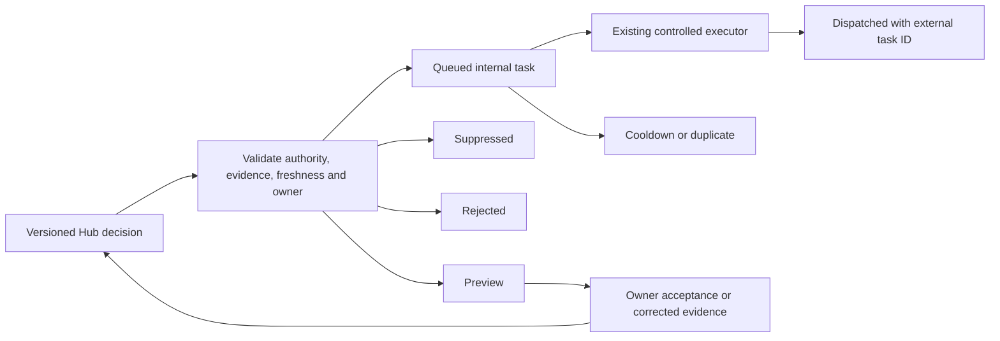

# Guarded Hub Workflow Extension Registry

**Contract:** `hub-workflow-extension-v1`  
**Authority:** Accepted Hub decisions and evidence  
**Scheduler:** Railway only  
**Default side effect:** Internal staff task  
**Current state:** Framework complete locally; selective activation only

## Purpose

This register governs the narrow layer between an accepted Hub exception and an internal operational action. It prevents an intelligence score, report row or unaccepted metric from silently becoming a client message or source-system change.

The Hub owns the decision envelope, idempotency key, outbox state, deduplication, cooldown, suppression and audit evidence. GHL, Stripe, Trainerize and PT Minder remain authoritative for the facts they originate.

## Common contract

Every proposal supplies:

- contract version, workflow key, stable decision ID and increasing decision version;
- canonical Hub person ID and the GHL contact ID only when a task may be required;
- authoritative source system, accepted snapshot ID, observation time, completeness and freshness;
- exception code, severity and current open or resolved state;
- explicit decision acceptance state, definition ID and approver, separate from technical readiness and metric publication;
- the matching Build 6 consumer, cutover authorisation, immutable cutover-status record ID and fingerprint when the policy depends on a downstream consumer;
- internal action type, title, instructions, due time and exact owner role plus GHL user ID;
- deduplication scope, suppression reasons and consent state;
- at least one evidence reference with authority, immutable record ID and fingerprint.

The Hub returns a deterministic idempotency key. The same decision version and action cannot produce two outbox records.

Combined Hub deployment `38c0d667-b23c-4bae-865f-fecc33e1a184` is successful and makes the final Build 2 lifecycle contract plus `current-person-v1` schema-v2 governed roster attributes live. Retention envelopes may cite its stable `person_id`, lifecycle source snapshot and immutable event lineage. The accepted suppression vocabulary is `approved_hold`, `active_cancellation_notice`, `downgrade_only_not_member_loss`, `staff_or_complimentary`, `resolved_or_inactive` and `lifecycle_unresolved`. This is evidence authority only and does not authorise a retention intervention or queue.

## State machine

`Preview` is the required outcome for shadow or unaccepted decisions, incomplete or stale sources, missing exact ownership, and workflow policies that have not been accepted. `Suppressed` applies when lifecycle, consent, resolution or other accepted controls say no action is appropriate. `Rejected` applies to any client message or source-system mutation.

## Workflow inventory and ownership

| Workflow key | Evidence authority | Exact operational owner | Deduplication scope | Cooldown | Suppression minimum | Current authority |
| --- | --- | --- | --- | --- | --- | --- |
| `retention_intervention_review` | Accepted Hub retention decision using GHL lifecycle and Trainerize engagement evidence | Member Experience: Alyssa Crighton, operationally Piper Mae, exact GHL user `WOBADTaoxWfMqNRqHmX0`; Megan Brown oversees and escalates as exact GHL user `adexBwouW9iBHpmiXrnN` | Person plus intervention reason and assessment window | 7 days | `approved_hold`, `active_cancellation_notice`, `downgrade_only_not_member_loss`, `staff_or_complimentary`, `resolved_or_inactive`, `lifecycle_unresolved`, stale or incomplete source, Piper unavailable or ownership unknown | Owner accepted; proposal only until two distinct Railway parity cycles and an authorised `retention_intelligence` cutover-status record |
| `conversation_support_routing` | Accepted Hub conversation case; GHL Conversations remains message and consent authority | Admin Eve, exact GHL user `EtONSa9U2pTpyOpX1hX8` | Conversation ID plus routing reason | 24 hours | Conversation read or resolved, assigned owner already active, opt-out for any later client action, stale or incomplete source | Peter approved one reversible non-deliverable controlled test, but live status is legacy, zero of two cycles and `promotion_authorised=false`; no contact or task may be created yet |
| `pt_booking_continuity` | Accepted Hub PT exception using GHL appointments and governed entitlement and lifecycle evidence | Admin Eve, exact GHL user ID required | Person, service relationship and governed booking window | 72 hours | Hold window, notice or end boundary, exact cross-calendar coverage, unresolved entitlement, already resolved task | Proposal only; requires two distinct Railway parity cycles and an authorised `pt_booking_continuity` cutover-status record before any task test |
| `revenue_exception_review` | Accepted Hub commercial exception; Stripe or PT Minder supplies payment facts; `current-person-v1` schema v2 supplies person-keyed roster delivery attributes | Admin Eve, exact GHL user ID required | Person, service relationship, evidence bucket and commercial period | 72 hours | Evidence gap rather than debt, approved hold, current retry already open, resolved exception, stale or incomplete source | Proposal only; the former contract gap is resolved, but it still requires one fresh exact schema-v2 parity cycle and an authorised `revenue_control` cutover-status record before any task test |
| `onboarding_outcome_followup` | Accepted GHL appointment decision with optional exact Trainerize corroboration | Assigned trainer first, then Admin Eve; both exact GHL IDs | Appointment ID plus coach or admin stage | 24 hours | Terminal GHL outcome, verified Trainerize delivery, old lookback, closed governed task | Internal task allowed through existing controlled executor |
| `strength_assessment_outcome_followup` | Accepted Hub SA reconciliation; GHL appointment and feedback form are primary evidence | Assigned trainer first, then Admin Eve; both exact GHL IDs | Appointment ID plus coach or admin stage | 24 hours | Terminal outcome, exact verified Trainerize assessment, historical boundary, closed governed task | Internal task allowed through existing controlled executor |

## Endpoints and storage

Protected Hub endpoints:

- `GET /api/v1/workflow-extensions/policies`: current policy and authority states;
- `POST /api/v1/workflow-extensions/preview`: validate and classify without persistence;
- `POST /api/v1/workflow-extensions/decisions`: persist the proposal or outbox result and its audit evidence;
- `GET /api/v1/workflow-extensions/outbox`: inspect protected records by workflow or person.

Durable tables:

- `hub_workflow_extension_outbox`: one deterministic action intent and its state;
- `hub_workflow_extension_audit`: append-only planning and future dispatch evidence.

No new scheduler is introduced. Downstream Railway services publish stable decision envelopes after their accepted refresh. The Hub records them. Existing accepted onboarding and SA task executors remain in place until a controlled migration proves the common dispatcher creates no duplicate task.

## Side-effect boundary

The common layer allows only `internal_task`. It rejects:

- client SMS, email, call or conversation replies;
- membership, payment, subscription or service changes;
- Trainerize activation, deactivation, access or programme changes;
- Google Sheet writes;
- appointment, lifecycle, payment or source-record corrections.

A future side effect requires its own accepted workflow authority, consent rule, exact owner, idempotency design, reversible controlled test and registry update. A task created by this layer may ask staff to review evidence; it must not present an evidence gap as a debt or instruct staff to infer a source fact.

## Audit and failure behaviour

- All decisions retain their policy version, source snapshot, evidence fingerprints, acceptance state, consent state, suppression reasons and result reasons.
- Duplicate submissions return the existing outbox state.
- Same-person, same-scope actions inside the policy cooldown do not queue again.
- Missing owner IDs fail to preview.
- Stale, partial or unavailable source evidence fails to preview.
- Technical readiness, metric acceptance and publication state do not substitute for a separately accepted workflow decision.
- A Build 6 policy cannot queue or begin its controlled task test unless `/api/v2/reporting/cutover-status` returns `promotion_authorised=true` for the exact matching consumer and the envelope binds its immutable status record ID and fingerprint. Generic authority, deployment success or permission to run a comparison cycle is insufficient.
- The Retention primary owner must be available and must match Piper's exact GHL user ID. A missing or unavailable primary owner fails to preview; Megan is retained as oversight and escalation rather than receiving an implicit reassignment.
- The approved Conversation test authority is bound to `build7-conversation-controlled-test-2026-08-03`. It applies only to a contact explicitly marked as a test contact with a `.invalid` email, Admin Eve as the exact internal owner, reversible cleanup and a fully authorised cutover record.
- Hub unavailability does not interrupt existing downstream reporting or accepted onboarding and SA task controls.
- Identified outbox data remains behind Hub authentication; aggregate dashboard surfaces do not expose it.

## Activation decisions

The framework does not need an owner decision to remain safe. Three policy activations do:

1. Retention ownership is resolved: Member Experience owns the review, Piper is the current operational assignee and Megan oversees the function. If Piper is unavailable, the action remains a preview and escalates for an explicit routing decision.
2. Conversation test authority is resolved, but execution is blocked. The protected 3 August status is legacy, `promotion_authorised=false`, technical and owner acceptance are false, zero of two scheduled comparison cycles exist, and no immutable acceptance record or fingerprint exists.
3. PT and revenue: wait for `/api/v2/reporting/cutover-status` to return `promotion_authorised=true` for the exact consumer. Revenue's person-keyed delivery contract is now live through `current-person-v1` schema v2, and Build 6 is authorised to run the fresh exact comparison cycle. That permission does not authorise an internal-task test. Only after the immutable Revenue cutover record passes may one controlled test be considered.

No client-facing permission is requested.
