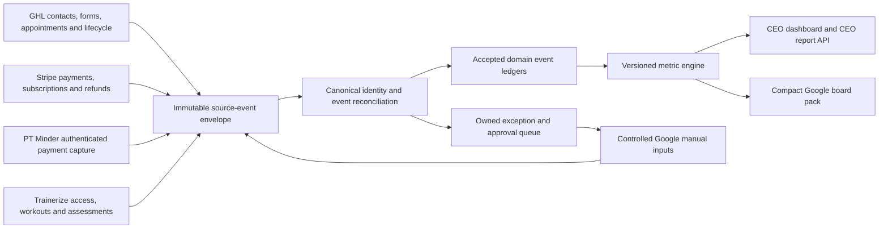

# Plan: Reporting V2 Governed Event Architecture

**Created:** 2026-07-29  
**Status:** In progress, protected shadow foundation implemented locally  
**Owner:** Peter Brown  
**Primary implementation surface:** Railway Operating Data Hub and CEO dashboard  
**Supporting surfaces:** GHL, Stripe, PT Minder, Trainerize and Google Sheets  
**Scheduling rule:** Railway only  
**Change authority:** Peter approved implementation on 29 July 2026. Protected shadow storage, contracts and tests are authorised. No current KPI workbook, accepted dashboard metric, live report, workflow or source-system record may be changed until its migration and acceptance gates pass.

---

## Executive Assessment

The current KPI workbook has reached the point where extending it creates more reporting risk than value. It performs four incompatible jobs at once:

1. it stores row-level operational records;
2. it accepts manual decisions and corrections;
3. it calculates business metrics through fixed spreadsheet formulas;
4. it presents the weekly management report.

This creates hidden coupling. A changed label, duplicated row, missing cancellation, manually toggled attendance field or moved formula can alter several downstream numbers without a complete audit trail.

Reporting V2 should make the Operating Data Hub the governed event, reconciliation and metric layer. The CEO dashboard becomes the main decision surface. Google Sheets remains useful, but only as a compact board pack and a controlled way to submit approved manual inputs.

The migration should be metric-by-metric, not a big-bang replacement. The current workbook remains unchanged and available as the comparison system until each V2 metric passes its own acceptance gate.

## Outcomes

Reporting V2 will provide:

- one accepted event ledger for leads, appointments, attendance, sales, payments and lifecycle changes;
- one canonical identity across GHL, Stripe, PT Minder, Trainerize and approved Google Sheet records;
- versioned metric definitions with visible numerators, denominators and source lineage;
- one unique Strength Assessment conversion count, even when a Fast Track sale contains both SGPT and PT services;
- confidence-labelled historical reporting rather than false precision;
- the same governed figures on the CEO dashboard, CEO report API and compact Google board pack;
- explicit missing, stale and unresolved states rather than guessed values;
- controlled manual inputs with evidence, approval and a complete audit trail;
- Railway as the only scheduler.

## Explicit Non-Goals

This plan does not authorise:

- editing the current KPI workbook;
- replacing any live CEO dashboard number;
- enabling the `SA Attendance` Sheet writer or GHL appointment writer;
- changing GHL workflows, tags, fields or appointment statuses;
- changing Stripe, PT Minder or Trainerize records;
- deleting historical spreadsheet tabs or formulas;
- presenting a low-confidence historical reconstruction as verified fact.

## Implementation Checkpoint: 29 July 2026

Implemented locally in protected shadow mode:

- immutable, versioned Reporting V2 source-event envelopes;
- Brisbane-local reporting dates with UTC source timestamps;
- versioned and immutable metric definitions;
- metric runs, observations, numerator, denominator and event lineage;
- confidence labels and historical raw-row hashing;
- one-sale/multiple-service-component storage and unique-conversion logic;
- appointment-series link primitives;
- controlled manual inputs with independent approval;
- parallel-run records that reject unexplained cutover variance;
- completed-week, rolling 28-day and rolling 90-day period contracts;
- Strength Assessment attendance projection into V2 shadow metrics;
- authenticated V2 status, metric-definition and board-pack-contract endpoints;
- a fail-closed manual-input API disabled by default;
- a non-publishing Google board-pack schema;
- Phase 0 metric, dependency, manual-input and owner-decision registers;
- read-only GHL lead, WARM-prequalification, signed-agreement and unique-conversion bridge;
- read-only GHL onboarding appointment bridge across the generic onboarding calendar, every current or historically relevant trainer Intro calendar and governed trainer PT calendars;
- sale-to-first-booking linkage with Fit & Flexible exclusion and Strong, Fast Track and PT-only entitlement rules;
- protected completed-week, rolling 28-day and rolling 90-day acquisition and onboarding preview metrics;
- Railway shadow schedule at 06:18 and 18:18 Brisbane;
- 106 passing Operating Data Hub tests.

Deployed in protected shadow mode on 30 July 2026:

- Reporting V2 foundation and read-only GHL acquisition bridge through Railway deployment `50d569f2-98e4-4c08-b2e6-1a81c4e9b80e`;
- the initial `sa-attendance-v2` protected legacy treatment through deployment `bad4101c-0f1d-47da-bd86-ea54a0559756`;
- Peter's corrected historical boundaries: listed show-rate tracking begins 12 March 2026, while listed conversion history is valid from 19 September 2025;
- separate read-only shadow metrics for listed show rate and listed conversion rate, without treating an Appointments K=`N` as a cancellation;
- the wider acquisition and onboarding shadow bridge through Railway deployment `810c3a04-f864-4eaa-a8aa-005da77a48df`;
- entitlement-specific onboarding calendar coverage repair through deployment `b54dfb06-2d6b-499e-b58e-1e4ab737c12e`;
- trainer-first onboarding outcome tasks with next-cycle Admin escalation through deployment `ecec9d28-e116-48be-b443-627ad79aa8cd`;
- exact-date tracked Trainerize corroboration resolved six onboarding sessions and four Strength Assessments on 30 July 2026; the six resulting trainer tasks auto-closed. On 31 July Peter owner-confirmed Jess Michels's exact 3 July appointment as Showed from camera evidence and later accepted the missing consultant submission as a permanent historical recording gap with no further chase required;
- Railway deployment `93b2689c-3646-4af4-9f0f-935ee5e0902f` made concurrent Strength Assessment reconciliation writes idempotent;
- Railway deployment `bc0d56ed-24a0-4266-9216-0eea195fcabb` added the permanent fail-closed Trainerize pre-check before Strength Assessment and onboarding staff tasks. Its first live run resolved two further assessments automatically, retained two unresolved cases for staff and verified every GHL status write;
- Railway deployment `ed90e9de-0e4a-4ef9-9ad7-c535e80e7094` added deactivated Trainerize profiles to historical attendance evidence and recovered Indie Cevallos's tracked assessment. Bita Gusti's 30 July appointment was subsequently confirmed Cancelled in GHL, leaving no current assessment unanswered. Jess Michels's owner-confirmed Showed correction is now live and protected by the repaired new-booking-only workflow trigger;
- first live period observations for leads, unique Strength Assessment bookings, prequalification completion, unique assessment conversion and sale-to-onboarding booking speed;
- first protected onboarding completion-speed observations, including 4.33 days across six verified rolling-28-day completions;
- no publication authority;
- existing KPI workbook and accepted CEO dashboard metrics unchanged.

Not yet implemented or authorised for live publication:

- event-parity acceptance of the GHL lead, prequalification, sale and assessment-attribution bridge;
- event-parity acceptance of completion speed after the first governed onboarding outcome task cycle closed successfully;
- Stripe cash-allocation adapters and the million-dollar cash-goal metric;
- lifecycle history backfill;
- PT appointment and trainer-capacity event bridges;
- creation or publication of the new Google board-pack workbook;
- any metric cutover.

---

## 1. Current-State Assessment

### 1.1 Current workbook roles

The `Brown & Casserly Pty Ltd 2026` workbook currently contains:

| Surface | Current role | Main risk |
|---|---|---|
| `KPI's The Evolved` | Weekly calculations and management presentation | Fixed row and column contracts; manual formula components; formula errors can propagate |
| `Subscribes` | Lead/subscriber row store | No immutable source event or contact ID in the visible legacy schema |
| `Appointments` | Booking, prequalification, attendance and conversion log | Manual Y/N fields; no appointment event ID in the legacy tab |
| `Sales` | Sale, cash taken, service mix, provisioning and onboarding checklist | Several different business events combined into one mutable row |
| `Active SGPT`, `Active PT`, `Active Online` | Current service rosters | Current snapshots are being used to infer historical movement |
| Cancellation tabs | Cancellation event and operational checklist | No stable source event ID; timing and final-access meaning can differ |
| `Consultant Performance` | Manual coaching assessment | Valuable manual evidence, but not a system event |
| hidden lead and paid-ads tabs | Supporting calculation data | Hidden dependencies make the calculation path difficult to audit |
| `SA Attendance` | Planned protected governed mirror | Correct event-level shape, but not yet accepted for live publication |

### 1.2 Current metric dependency findings

The current scripts and workbook formulas establish these dependencies:

- Active SGPT and PT totals use fixed historical baselines plus cumulative sales less cancellations. This can drift from the real current roster and lifecycle state.
- Active roster readers separately deduplicate current SGPT and PT rows. The workbook and the hub can therefore show different concepts under similar “active” labels.
- Leads are counted from the date an Appointments row was created rather than from a governed lead-created event.
- Bookings are counted from the scheduled appointment date in the Appointments tab.
- Attendance and show rate depend on the manual `Show?` field. Only `Y` counts as attended.
- Conversion depends on a separate manual `Convert?` field or the existence of Sales rows, without a stable appointment-to-sale link.
- SGPT sales include Bronze and Silver. PT sales include PT products and Silver. Silver, now Fast Track, is therefore intentionally present in both service-mix totals.
- Total sales count Sales rows. This is not a governed unique assessment conversion because a row has no immutable sale or assessment identity.
- New cash is read from the Sales `Cash Taken` column.
- Weekly total cash and ad spend include manual entries or manually composed formulas.
- PT booked hours and session counts appear as weekly values rather than a complete event ledger in the workbook.
- The Operating Data Hub still imports several KPI results from fixed cells, even though canonical rosters, payment evidence and Strength Assessment attendance are already moving to governed models.

### 1.3 Manual-input inventory

The discovery phase must create a cell- and field-level register, but the existing manual-input classes are already clear:

| Manual input | Current location or behaviour | V2 treatment |
|---|---|---|
| Cash not supplied by an accepted processor feed | Weekly KPI cash components | Controlled manual cash event with evidence and approval |
| Ad spend | Weekly KPI values or supporting tab | API event where available; otherwise approved manual spend event |
| Appointment prequalification | Appointments Y/N field | GHL event or versioned governed manual outcome |
| Attendance and conversion | Appointments Y/N fields | Reconciled GHL appointment, feedback and sale evidence |
| Sale cash taken | Sales row | Sale allocation evidence, not settled-payment authority |
| Provisioning and onboarding checks | Sales columns | Separate fulfilment and onboarding events |
| Cancellation details | Cancellation tabs | GHL lifecycle event plus controlled exception where needed |
| Trainer capacity, leave or temporary availability | Not represented as a complete governed ledger | Effective-dated manual capacity and exception events |
| Consultant-quality scores | Consultant Performance tab | Approved manual assessment event, separate from funnel conversion |
| Targets, budgets and board commentary | KPI presentation | Controlled planning inputs, never mixed with actual events |

### 1.4 Material current risks

1. **Identity risk:** many historical rows identify people using mutable names, emails and phone numbers rather than immutable source IDs.
2. **Double-counting risk:** Fast Track is one commercial sale with both SGPT and PT service components. Service-mix counts are valid, but they must not create two assessment conversions.
3. **Time risk:** the workbook is configured for `Australia/Sydney`, while business reporting is governed in `Australia/Brisbane`. Daylight-saving periods can move events across local reporting dates.
4. **State-versus-event risk:** current roster tabs show present state but are used in formulas that imply historical movement.
5. **Cash-definition risk:** Sales cash taken, processor cash settled, bank cash received and refunds are different events. Accounting turnover remains outside the dashboard until a reliable accounting feed exists.
6. **Formula-contract risk:** downstream scripts depend on fixed cell positions and mutable spreadsheet labels.
7. **Provenance risk:** manual changes often lack a recorder, timestamp, reason, source document and approval state.
8. **Silent completeness risk:** a missing or stale source can still leave a plausible-looking spreadsheet number.

---

## 2. Reporting V2 Governance Rules

### 2.1 Source authority

| Domain | Authoritative source | Supporting evidence | Explicit limitation |
|---|---|---|---|
| Contact identity and lifecycle | GHL | Google Sheet historical rows, Stripe customer, Trainerize profile | A tag alone is not an event |
| Lead creation and first-touch attribution | GHL | legacy Subscribes/Appointments rows | Attribution changes require a versioned correction |
| Appointment schedule and status | GHL appointment event | Consultant feedback, legacy Appointments row | Contact-level stages cannot identify a specific appointment |
| Assessment delivery | Reconciled GHL appointment plus accepted delivery evidence | Consultant Feedback | Sheet `Show?` is comparison evidence only |
| Commercial sale or agreement | Accepted agreement/sale event | Sales row, Stripe purchase | A multi-service sale remains one sale |
| Cash collected | Settled Stripe or accepted PT Minder payment event; approved bank/manual cash event where necessary | Sales cash taken | PT Minder Charge and displayed balance are ignored |
| Turnover | Accepted accounting rule applied to sale and service-period events | payment allocations | Turnover is not interchangeable with cash |
| Trainerize access and engagement | Trainerize | GHL onboarding | Trainerize is not payment or active-membership authority |
| Current service and entitlement | Reconciled lifecycle, payment, agreement and approved exception evidence | current rosters | Presence in one source is only a signal |
| Manual planning or exception data | Controlled Google input surface | linked source document | Manual input cannot directly overwrite a calculated metric |

### 2.2 Time, money and update rules

- Persist all source times in UTC and derive one `Australia/Brisbane` local date.
- Never use workbook timezone interpretation as V2 event authority.
- Store AUD money as integer cents, with currency recorded explicitly.
- Preserve `occurred_at`, `effective_at`, `observed_at` and `accepted_at` separately.
- Source corrections append a new version or superseding event. They do not silently overwrite history.
- Every source ingestion is idempotent.
- Missing or stale evidence returns `Unavailable` or an exception state.
- A calculation is accepted only from accepted source events.
- Ratios are recalculated from their accepted numerator and denominator. Percentages are never averaged.
- Stock metrics use an as-of time. Flow metrics use a defined start and end time.

### 2.3 Metric governance

Create a versioned metric dictionary with, at minimum:

- metric ID and plain-English name;
- decision question the metric answers;
- event grain;
- source authority;
- inclusion and exclusion rules;
- numerator and denominator;
- local reporting period;
- correction and late-arriving-event policy;
- minimum source freshness;
- confidence requirement;
- owner and approver;
- definition version and effective dates;
- drill-down contract;
- legacy workbook comparison cell or formula;
- cutover state.

Every API result should return the metric definition version, numerator, denominator, source run IDs, freshness and unavailable reason.

---

## 3. Target Architecture

### 3.1 Data flow

### 3.2 Shared source-event envelope

Add a reusable event envelope rather than creating a separate ingestion pattern for every report:

- `source_system`
- `source_object_type`
- `source_event_id`
- `source_object_id`
- `source_version` or payload fingerprint
- `occurred_at`
- `effective_at`
- `observed_at`
- `accepted_at`
- `source_run_id`
- `raw_payload_reference`
- `payload_hash`
- `schema_version`
- `supersedes_event_id`
- `acceptance_state`
- `rejection_reason`

The unique ingestion key should use the stable source event ID where available. When a source provides mutable objects rather than events, a new observation is stored only when the material payload fingerprint changes.

### 3.3 Canonical entities

Reuse and extend the hub’s existing canonical people and source-identity model:

- `canonical_people`
- `source_identities`
- `identity_link_decisions`
- `commercial_agreements`
- `service_relationships`
- `entitlements`
- `payment_accounts`
- `trainer_identities`
- `appointment_series`

Identity matching must prefer source IDs. Email and mobile can support a match, but ambiguous or shared identifiers must create an exception rather than an automatic merge.

### 3.4 Accepted domain ledgers

Build the following event-level ledgers:

| Ledger | Natural grain | Required stable identity |
|---|---|---|
| `hub_lead_events` | one lead-created or attribution-change event | GHL contact and event/object ID |
| `hub_prequalification_events` | one required, completed, waived or expired state transition | GHL contact and submission/workflow event |
| `hub_appointment_events` | one appointment observation or status transition | GHL appointment ID |
| `hub_assessment_delivery_events` | one accepted delivery decision | assessment appointment ID |
| `hub_sale_events` | one commercial sale/agreement | agreement, invoice or accepted source sale ID |
| `hub_sale_service_components` | one service component within a sale | sale ID plus service type |
| `hub_sale_attributions` | one governed relationship between sale and assessment | sale ID plus assessment appointment ID |
| `hub_payment_events` | one settled, failed, pending, refunded or reversed money event | processor event ID |
| `hub_payment_allocations` | one allocation of cash to agreement/service/new-cash class | payment event ID plus allocation |
| `hub_lifecycle_events` | one activation, hold, downgrade, cancellation notice, final-access or return event | source lifecycle event ID |
| `hub_onboarding_events` | one booked, completed, cancelled or missed onboarding appointment | GHL appointment ID |
| `hub_pt_appointment_events` | one PT appointment status/version | GHL appointment ID |
| `hub_manual_input_events` | one approved manual input or correction | generated input ID with approval |

Existing current-state tables remain useful as projections. They should be reproducible from accepted events and must not replace the event history.

### 3.5 Metric storage

Replace opaque metric JSON as the only durable calculation result with queryable, versioned records:

- `metric_definitions`
- `metric_runs`
- `metric_observations`
- `metric_lineage`
- `metric_reconciliation_results`

Each metric observation stores the exact period or as-of time, value, numerator, denominator, definition version, confidence, source freshness and accepted event-set fingerprint.

---

## 4. Unique Appointment Conversion

### 4.1 Governing definition

The overall Strength Assessment conversion rate is:

> Unique attended Strength Assessment appointment series that produced at least one qualifying new-membership sale within the approved attribution window, divided by unique attended Strength Assessment appointment series.

This is an appointment conversion metric, not a count of service components.

### 4.2 Reschedules and appointment series

- Every GHL appointment keeps its immutable appointment ID.
- Linked cancellations and rebookings form one `appointment_series_id`.
- Only the terminal delivered appointment is eligible for the attendance denominator.
- Cancelled, invalid and superseded appointments are reported separately and excluded.
- An elapsed appointment still marked Confirmed is unresolved, not automatically attended or no-show.
- Multiple delivered assessments for the same person remain separate appointments unless an approved rule identifies one as a duplicate correction.

### 4.3 Sale and service separation

A Fast Track sale is represented as:

- one `sale_event`;
- one governed assessment attribution;
- one SGPT service component;
- one PT service component.

This produces:

- `overall sales = 1`;
- `assessment conversions = 1`;
- `Fast Track sales = 1`;
- `SGPT services sold = 1`;
- `PT services sold = 1`.

The dashboard must label service components as service mix, not total conversions.

### 4.4 Add-ons, upgrades and later purchases

- A PT add-on bought by an existing member is a sale but not automatically a new Strength Assessment conversion.
- A downgrade or upgrade is a lifecycle/commercial change, not a new client.
- A later prepaid PT pack is a new commercial sale linked to the existing person, not a duplicate acquisition conversion.
- A sale can link to only one acquisition assessment under a selected attribution rule.
- Unlinked sales remain visible in an attribution exception queue.

### 4.5 Owner decision required before implementation

Approved by Peter Brown on 29 July 2026:

1. use the most recent attended assessment inside a 30-day sale window;
2. classify returning former members as reactivations, not new acquisition conversions;
3. allow a late qualifying agreement inside the window to update the original assessment cohort while retaining the initial No Sale evidence;
4. group cancellations and rebooks into one appointment series, while retaining genuinely repeated delivered assessments separately.

The deterministic attribution logic and regression fixtures are implemented in `operating_data_hub/reporting_v2.py`.

---

## 5. Historical Migration and Confidence

### 5.1 Preserve the original evidence

Before importing historical data:

1. export the complete current workbook and record its file hash, workbook ID, tab IDs, dimensions and export time;
2. create read-only raw imports for every relevant tab;
3. retain source tab, row number, original cell values, formulas and row hash;
4. capture available historical extracts from GHL, Stripe, PT Minder and Trainerize;
5. do not repair source history during extraction.

### 5.2 Historical confidence labels

| Label | Meaning | Permitted use |
|---|---|---|
| `verified` | Stable source event ID or exact cross-source match | Official metric and identified drill-down |
| `high` | Exact canonical person plus compatible time, product and amount evidence | Official aggregate; identified drill-down with confidence label |
| `medium` | Probable identity/date match but no stable event link | Trend with visible confidence; exception review |
| `low` | Workbook-only row, ambiguous identity or material fields missing | Historical context only |
| `legacy_aggregate` | Only a weekly total or formula result survives | Historical chart continuity only; no invented member drill-down |
| `unresolved` | Conflicting or duplicate evidence | Excluded from accepted metric until adjudicated |

Confidence is recorded per event and per metric period. A high-confidence weekly total must not imply that every underlying member is verified.

### 5.3 Backfill sequence

1. Import immutable raw evidence.
2. Normalise timestamps to UTC and Brisbane local date while preserving original text.
3. Resolve source identities to canonical people.
4. Deduplicate exact source events.
5. Construct appointment series and status history.
6. Link accepted attendance, sale and payment evidence.
7. Split commercial sales from their service components.
8. Build lifecycle transitions and as-of service projections.
9. Calculate confidence and quarantine conflicts.
10. reproduce historical metrics from accepted events where possible.
11. retain legacy weekly aggregates where event reconstruction is not defensible.
12. publish a migration reconciliation pack without changing live reports.

### 5.4 Historical acceptance gates

- No invented source IDs or event timestamps.
- Every imported record has source, location and row/object provenance.
- Every automatic identity merge is reproducible.
- Every unresolved duplicate is quarantined.
- Accepted money events reconcile exactly in cents to the available processor or approved bank evidence.
- Historical gaps are visible by metric and period.
- A board pack can distinguish verified, estimated and legacy-only periods.

---

## 6. Future Google Sheet

### 6.1 Intended role

Google Sheets remains:

- a compact board pack;
- a controlled manual-input surface;
- an exception and approval work queue;
- a human-readable metric dictionary and reconciliation status view.

It is not:

- the raw event database;
- the identity-matching engine;
- the payment ledger;
- the active-member source of truth;
- the calculation engine;
- the scheduler.

### 6.2 Proposed workbook structure

| Tab | Direction | Purpose |
|---|---|---|
| `Board Pack` | Hub to Sheet | Current week, 28-day, 90-day and year-to-date CEO measures |
| `Trends` | Hub to Sheet | Compact accepted historical series and confidence |
| `Manual Inputs` | Sheet to Hub | Controlled values with evidence and approval |
| `Exceptions & Decisions` | Hub to Sheet; approved decisions return through controlled fields | Owned unresolved cases |
| `Metric Dictionary` | Hub to Sheet | Plain-English definitions, sources and versions |
| `Source Health` | Hub to Sheet | Freshness, last accepted run and cutover state |
| `Migration Reconciliation` | Hub to Sheet | Legacy-versus-V2 comparison during parallel run |

### 6.3 Manual-input contract

Every manual input requires:

- immutable `input_id`;
- input type;
- effective date or period;
- value and unit;
- source document or reference;
- submitted by and submitted at;
- reason;
- approval status;
- approved by and approved at;
- superseded input ID where applicable;
- validation state and rejection reason.

A Sheet edit never directly changes a dashboard metric. Railway reads the pending input, validates it, accepts or rejects it, records the decision and recalculates the affected metric from the accepted manual event.

### 6.4 Board-pack publishing rule

- Publish values, definitions, freshness and confidence, not spreadsheet business logic.
- Protect hub-output ranges.
- Make “Unavailable” visible when a source gate fails.
- Do not reproduce operational event logs in the board pack.
- Do not create a second calculation path in Sheet.

---

## 7. Strength Assessment Attendance as Component One

The existing `sa-attendance-v1` work should become the reference implementation for Reporting V2 rather than an isolated report repair.

It already demonstrates:

- immutable GHL appointment IDs;
- append-only appointment observations;
- deterministic feedback evidence;
- reconciled canonical status;
- rule versioning;
- source run and snapshot lineage;
- exception ownership;
- protected aggregate and identified APIs;
- a disabled Sheet writer behind an explicit gate.

### 7.1 Required expansion before acceptance

Use the Strength Assessment component to establish the shared V2 patterns:

1. move its source observation format behind the common event envelope;
2. add appointment-series handling for cancellations and rebooks;
3. separate appointment status from accepted delivery evidence;
4. define the exact eligible denominator and unresolved grace period;
5. attach metric numerator, denominator, source lineage and confidence;
6. add the unique sale-attribution relationship without folding service mix into conversion;
7. prove backfill confidence labels against legacy column K;
8. publish the comparison only to the migration reconciliation surface;
9. keep GHL and Sheet writers disabled until the V2 gates pass.

### 7.2 Why it is first

Strength Assessment attendance exercises the core architecture without requiring every financial and lifecycle dependency at once. It contains:

- immutable source events;
- mutable status observations;
- cross-source evidence;
- reschedules and cancellations;
- manual historical data;
- an executive ratio;
- identified exception handling;
- a downstream conversion relationship.

Once accepted, the same ingestion, reconciliation, metric and publication pattern can be reused for leads, sales, onboarding, payments and lifecycle.

---

## 8. Implementation Phases

### Phase 0: Definition and change freeze

**Purpose:** agree what every current KPI means before replacing it.

Deliver:

- complete current metric inventory;
- workbook cell/formula and script dependency register;
- manual-input register;
- source-authority matrix;
- current-vs-proposed metric dictionary;
- timezone, cash-goal, attribution and lifecycle decisions;
- frozen acceptance sample periods.

Gate:

- Peter approves every CEO metric name and plain-English definition.
- Each metric has one owner, one authority rule and a cutover gate.
- No implementation begins for an ambiguous metric.

### Phase 1: Common event and metric foundation

Deliver:

- shared source-event envelope;
- event schema registry;
- accepted/rejected event states;
- source-run ledger;
- canonical identity decision ledger;
- versioned metric-definition tables;
- lineage and reconciliation tables;
- Brisbane reporting calendar;
- AUD-cents money type;
- privacy and retention controls.

Gate:

- replaying the same source payload creates no duplicates;
- source corrections create new versions;
- every metric result is traceable to accepted event IDs;
- a missing source fails visibly.

### Phase 2: Strength Assessment attendance vertical slice

Deliver:

- accepted appointment/status ledger;
- appointment-series and reschedule model;
- feedback-to-appointment reconciliation;
- attendance exception queue;
- confidence-labelled history;
- governed attended, no-show, cancelled, invalid and unresolved counts;
- V2 show-rate metric;
- migration comparison view.

Gate:

- complete event-ID coverage for the live GHL comparison period;
- zero unexplained duplicate eligible appointments;
- every elapsed appointment is terminal or explicitly unresolved;
- zero incorrect `Showed` proposals across the approved shadow period;
- manually reviewed numerator and denominator match exactly;
- existing Sheet and GHL writers remain off until sign-off.

### Phase 3: Leads, prequalification and unique conversion

Deliver:

- lead-created and first-touch events;
- prequalification state events;
- sale events and service components;
- assessment-to-sale attribution;
- unique conversion metric;
- unlinked sale and ambiguous attribution queues.

Gate:

- Fast Track fixtures prove one conversion with two service components;
- existing-member PT add-ons do not count as new acquisitions;
- all sales in the acceptance sample are linked, explicitly unlinked or excluded with a reason;
- source totals and unique-person totals are both visible.

### Phase 4: Payments, cash goal and lifecycle

Deliver:

- accepted Stripe and PT Minder event adapters;
- pending, failed, settled, refunded and reversed states;
- approved bank/manual cash events;
- payment allocations;
- new cash, recurring cash and total cash as separate metrics;
- continuously rolling 365-day million-dollar progress from accepted cash excluding GST, with no calendar or financial-year reset and a retained first-achieved timestamp;
- accounting turnover explicitly unavailable until a reliable accounting-system feed exists;
- activation, hold, downgrade, cancellation notice, final-access, return and reactivation events;
- as-of active-client and membership-mix projections.

Gate:

- accepted cash matches processor and approved bank evidence exactly in cents;
- PT Minder Charge and displayed balance never enter accepted cash;
- pending is not treated as failed or collected;
- refunds and reversals follow the approved reporting-date rule;
- active-client movement reconciles from lifecycle events rather than a fixed baseline waterfall.

### Phase 5: CEO dashboard and board-pack projections

Deliver:

- CEO scorecard API using the V2 metric engine;
- weekly, 28-day, 90-day and year-to-date period contracts;
- plain-English CEO dashboard cards and drill-downs;
- compact Google Board Pack;
- controlled Manual Inputs and Exceptions tabs;
- source health, confidence and definition display.

Gate:

- dashboard, API and board pack use the same metric observation IDs;
- there is no Sheet-side calculation of a governed V2 result;
- values do not publish when a required source is stale;
- identified detail remains authenticated.

### Phase 6: Parallel run and metric-by-metric cutover

Deliver:

- automated legacy-versus-V2 reconciliation;
- variance classification;
- sign-off record by metric and period;
- compatibility reader switch;
- rollback control.

Gate:

- the global cutover requirements below are met for each metric.

### Phase 7: Legacy retirement

Deliver:

- frozen read-only archive of the current workbook;
- removed production dependency on fixed KPI cells;
- disabled compatibility readers only after observation;
- updated reporting-control documentation and runbooks.

Gate:

- no live consumer reads a retired spreadsheet calculation;
- rollback period has ended without material failure;
- all operational manual inputs have a governed replacement;
- Peter approves archival status.

---

## 9. Parallel Run, Acceptance and Cutover

### 9.1 Parallel-run duration

Run legacy and V2 concurrently for at least:

- eight completed Monday-to-Sunday reporting weeks;
- one month-end boundary;
- one payment-failure and retry case;
- one cancellation/final-access case;
- one hold or future-start case;
- one Fast Track multi-service sale;
- one rescheduled Strength Assessment.

The first four consecutive clean weeks may satisfy a simple event metric, but no financial or active-client metric cuts over before the full eight-week window.

### 9.2 Required acceptance gates per metric

| Gate | Requirement |
|---|---|
| Definition | Owner-approved plain-English definition, grain and exclusions |
| Source | Required sources fresh and schema-valid |
| Completeness | 100% of required accepted fields for included events |
| Identity | At least 99% automatic canonical match and 100% review of material unmatched cases |
| Deduplication | Zero unexplained duplicate source IDs or business events |
| Event audit | Exact agreement with the approved manual event sample |
| Ratio audit | Exact numerator and denominator agreement after approved legacy corrections |
| Money | Zero unexplained cent variance to accepted processor/bank evidence |
| Variance | Every legacy difference classified as V2 defect, legacy defect, timing, definition change or unresolved |
| Freshness | Meets the metric-specific service level in every accepted period |
| Reproducibility | Same accepted event set and definition version produce the same value |
| Surface parity | CEO dashboard, CEO API and board pack return the same accepted observation |
| Sign-off | Peter approves business meaning; system owner approves technical evidence |

### 9.3 Variance policy

V2 is not required to copy a known-wrong workbook result. Where values differ:

1. preserve both values;
2. identify the exact event-level difference;
3. classify the cause;
4. correct V2 if it is wrong;
5. document the legacy defect if the workbook is wrong;
6. obtain owner approval for a definition change;
7. do not hide the variance with a tolerance.

Tolerances may be used for monitoring, but not to waive an unexplained event or money difference.

### 9.4 Cutover unit

Cut over one named metric family at a time:

1. Strength Assessment attendance and show rate;
2. leads and prequalification;
3. unique assessment conversion and service mix;
4. cash and payment status;
5. lifecycle movement and active clients;
6. onboarding, PT utilisation and other operational measures.

The dashboard must show the metric’s source as `Legacy`, `V2 Shadow` or `V2 Accepted`.

### 9.5 Rollback

- Keep the legacy reader available for one full reporting cycle after each cutover.
- Retain the last accepted V2 metric observation and its event-set fingerprint.
- A source-health, schema or parity failure prevents a new value from replacing the last accepted value.
- Rollback changes the publication pointer, not source history.
- Never delete V2 events to recreate a legacy number.

---

## 10. Testing, Controls and Operations

### 10.1 Required automated tests

- repeated source delivery is idempotent;
- mutable source observation creates a new version;
- source deletion or invalidation is represented explicitly;
- Brisbane date boundaries and Sydney daylight-saving divergence;
- cents-exact payment arithmetic;
- pending, failed, retried, settled and refunded payment sequences;
- assessment cancellation, reschedule, no-show and unresolved cases;
- one Fast Track sale with SGPT and PT components;
- existing-member PT add-on exclusion from new-member conversion;
- duplicate email, changed email, shared phone and missing-ID identity cases;
- late-arriving and corrected events;
- metric replay reproducibility;
- stale-source fail-closed behaviour;
- protected Google output and controlled manual-input validation;
- authenticated identified drill-downs.

### 10.2 Operational controls

- Railway owns every scheduled ingestion, reconciliation and publication job.
- Job runs record start, completion, status, source counts and errors.
- Source freshness thresholds are set per source.
- Exceptions have severity, owner, due date, evidence and resolution.
- No member messaging, membership change or payment action is triggered by Reporting V2.
- PT Minder remains a manual authenticated capture when Peter is logged in; the resulting ingestion is governed and auditable.
- Manual corrections require an approved event, never a direct database edit.

### 10.3 Privacy

- CEO aggregates exclude identified data by default.
- Identified drill-downs require authentication and role permission.
- Google board-pack outputs contain only the minimum required personal information.
- Raw payment payloads and sensitive form data are retained behind the protected hub boundary.
- Historical extracts use access-controlled storage and documented retention.

---

## 11. Required Owner Decisions

These decisions must be made before their dependent metric is implemented:

1. Strength Assessment-to-sale attribution window.
2. Treatment of returning former members in new-member conversion and growth.
3. Cash-collected date for Stripe, PT Minder, bank transfers, refunds and reversals.
4. The million-dollar measure is approved as accepted cash collected excluding GST across the immediately preceding 365 days. It has no calendar or financial-year reset. Accounting turnover is outside the dashboard until a reliable accounting-system feed exists.
5. Which non-API cash and spend items are allowed as manual inputs.
6. Active-client definition across paid-in-advance, approved holds, future starts, notice periods and PT-only arrangements.
7. Source-freshness thresholds and when the dashboard should show `Unavailable`.
8. Minimum historical confidence allowed in official board reporting.
9. Named business owner and absence cover for manual inputs and exception decisions.
10. Whether the future board pack replaces the current workbook or is created as a separate controlled workbook after acceptance.

---

## 12. Deliverables

- current KPI metric and dependency register;
- manual-input and source-authority register;
- approved Reporting V2 metric dictionary;
- event schemas and source contracts;
- unique conversion and appointment-series specification;
- historical migration inventory and confidence report;
- event-level migration reconciliation pack;
- Strength Assessment vertical-slice acceptance report;
- eight-week parallel-run pack;
- metric-by-metric cutover register;
- future Google Board Pack specification;
- rollback and incident runbook;
- updated reporting-control-plane and architecture documentation;
- updated CEO dashboard data contract.

---

## 13. Definition of Done

Reporting V2 is complete only when:

- the Operating Data Hub stores accepted event-level evidence for the agreed CEO metrics;
- the CEO dashboard is the primary accepted decision surface;
- the CEO API and Google board pack use the same accepted metric observations;
- Fast Track is one commercial conversion with separate SGPT and PT components;
- historical metrics show their confidence and provenance;
- all accepted manual inputs are validated, approved and auditable;
- no governed metric depends on a spreadsheet formula or fixed KPI cell;
- every cutover metric has passed its acceptance and parallel-run gates;
- the current KPI workbook has been frozen as a read-only historical reference;
- Railway is the only scheduler;
- rollback and source-failure behaviour have been tested;
- Peter has approved the final cutover.

---

## Relationship to Existing Plans

- `plans/2026-07-29-strength-assessment-attendance-source-of-truth.md` becomes the first vertical slice of this architecture. Its existing live-write gates remain in force.
- `plans/2026-07-29-ceo-scorecard-periods-and-million-goal.md` remains the downstream dashboard and decision-surface plan. Reporting V2 becomes its governing data layer.
- `outputs/systems/reporting-control-plane.md` remains the operational architecture register and should be updated only when implementation changes become accepted.

## First Authorised Next Step

After Peter approves this plan, begin Phase 0 only: produce the complete metric dictionary, workbook dependency register, manual-input register and owner-decision pack. Do not alter the current workbook or live reports during Phase 0.

## 2 August 2026 lifecycle implementation checkpoint

`membership-lifecycle-v1` is now implemented in the Operating Data Hub as a
shadow-only, immutable event and metric family. It uses GHL lifecycle evidence
already carried by the membership reconciliation feed, canonical Hub person
IDs and exact Brisbane periods. Fast Track is one unique member; PT-only
service endings on continuing SGPT/Fast Track relationships are downgrade-only.
Historical candidates without an exact effective date or complete
verified/high-confidence evidence are quarantined, and attrition is unavailable
without an exact person-level opening cohort for the requested period start.

The protected `current-person-v1` read contract is the downstream compatibility
boundary. It exposes lifecycle, service, entitlement and payment evidence with
explicit completeness and source lineage, but does not authorize outreach,
membership changes, payments or publication. Railway remains the sole
scheduler, and the accepted dashboard and KPI workbook remain unchanged until
the metric acceptance controller and Peter's separate publication decision
both pass.
